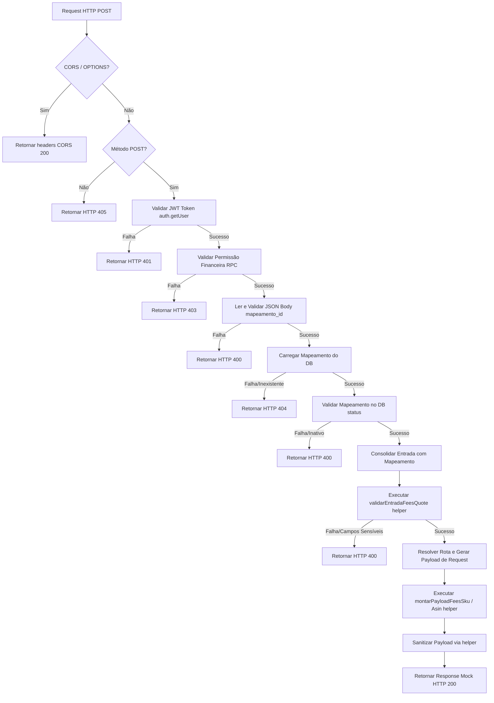

# Contrato de Taxas Marketplace API - Fase 5.4A

## 1. Contexto

Este documento registra o contrato tecnico planejado para a Fase 5.4 do Modulo 5 - Custos e Margem Estimada.

O objetivo da fase e preparar a integracao futura de taxas por API sem transformar o Primely Store em ERP operacional. O Primely continua sendo painel gerencial inteligente: consulta, consolida, audita, simula e apoia decisao.

Escopo planejado:

- Amazon SP-API Product Fees;
- Mercado Livre `listing_prices` e cotacoes logisticas;
- persistencia de historico em `marketplace_fee_quotes`;
- atualizacao controlada de caches calculados em `produtos_precificacao`;
- uso de matrizes locais como fallback;
- protecao total de tokens, secrets e credenciais.

Este documento nao implementa Edge Functions, nao cria migrations e nao altera banco. Ele define somente o contrato esperado para as proximas microetapas.

---

## 2. Edge Function futura `amazon-fees-quote`

### 2.1. Objetivo

Consultar a Amazon SP-API Product Fees para estimar taxas de marketplace e, quando identificavel, taxas logisticas/FBA de um produto em um canal Amazon.

A consulta deve ser feita exclusivamente por Edge Function ou backend confiavel. O frontend nunca deve chamar SP-API diretamente.

### 2.2. Request esperado

| Campo | Tipo | Obrigatorio | Descricao |
|---|---|---|---|
| `produto_id` | uuid | Sim | Produto interno do Primely. |
| `canal_venda_id` | uuid | Sim | Canal Amazon cadastrado no Primely. |
| `seller_sku` | string | Sim | SKU usado na conta Amazon. |
| `asin` | string | Nao | Identificador Amazon, se aplicavel em consulta futura. |
| `marketplace_id` | string | Sim | Marketplace Amazon alvo. |
| `preco_consultado` | number | Sim | Preco usado para estimar as taxas. |
| `moeda` | string | Sim | Moeda da cotacao, por exemplo `BRL`. |
| `is_amazon_fulfilled` | boolean | Sim | Define se a simulacao e FBA (`true`) ou FBM (`false`). |
| `shipping_estimado` | number | Nao | Frete estimado quando aplicavel. |
| `atualizar_precificacao` | boolean | Nao | Se deve atualizar `produtos_precificacao`. Default futuro recomendado: `true`. |

### 2.3. Response esperado

| Campo | Tipo | Descricao |
|---|---|---|
| `success` | boolean | Resultado da operacao. |
| `fee_quote_id` | uuid/null | ID criado em `marketplace_fee_quotes`, quando houver gravacao. |
| `produto_id` | uuid | Produto consultado. |
| `canal_venda_id` | uuid | Canal consultado. |
| `marketplace` | string | Valor esperado: `amazon`. |
| `taxa_marketplace_calculada` | number | Taxa principal de marketplace estimada pela API. |
| `taxa_logistica_calculada` | number | Taxa logistica/FBA quando identificavel. |
| `custo_total_calculado` | number | Soma das taxas calculadas. |
| `origem` | string | `api`, `matriz`, `estimativa_padrao` ou `manual`. |
| `status` | string | `sucesso` ou `erro`. |
| `erro` | string/null | Erro sanitizado, sem segredo. |

### 2.4. Mapeamento para `marketplace_fee_quotes`

| Coluna | Valor planejado |
|---|---|
| `produto_id` | `request.produto_id` |
| `canal_venda_id` | `request.canal_venda_id` |
| `produto_sku_snapshot` | `request.seller_sku` |
| `canal_nome_snapshot` | Nome do canal Amazon no momento da consulta. |
| `origem` | `api` quando SP-API responder com sucesso. |
| `marketplace` | `amazon` |
| `tipo_consulta` | `sp_api_product_fees_sku` |
| `preco_consultado` | `request.preco_consultado` |
| `taxa_marketplace_calculada` | Total/referral fee identificada na resposta. |
| `taxa_logistica_calculada` | Taxa FBA/logistica identificada, quando confiavel. |
| `custo_total_calculado` | Soma de taxa marketplace e logistica. |
| `payload_bruto` | Payload de resposta sanitizado. |
| `status` | `sucesso` ou `erro`. |
| `erro` | Mensagem sanitizada quando houver falha. |

### 2.5. Mapeamento para `produtos_precificacao`

| Coluna | Regra planejada |
|---|---|
| `origem_taxa_marketplace` | `api` quando a cotacao for valida. |
| `taxa_marketplace_calculada` | Valor estimado pela SP-API. |
| `origem_taxa_logistica` | `api` quando a taxa logistica/FBA for confiavel; caso contrario fallback. |
| `taxa_logistica_calculada` | Valor retornado ou calculado. |
| `data_ultima_consulta_api` | Momento da cotacao. |
| `fee_quote_id` | ID da cotacao gravada em `marketplace_fee_quotes`. |

Regra de protecao: nao sobrescrever um futuro `manual_override` ativo sem regra explicita aprovada pelo usuario.

### 2.6. Erros e fallbacks

| Situacao | Acao planejada |
|---|---|
| API retorna sucesso | Gravar cotacao e atualizar cache, se permitido. |
| Rate limit | Registrar erro sanitizado e usar fallback conforme precedencia. |
| Token vencido/permissao negada | Registrar erro de integracao, sem expor token. |
| Payload incompleto | Gravar erro ou cotacao parcial, sem atualizar cache critico. |
| SKU sem configuracao | Retornar erro validavel e sugerir completar mapeamento. |

---

## 3. Edge Function futura `mercadolivre-fees-quote`

### 3.1. Objetivo

Consultar custos de venda e logistica do Mercado Livre para estimar comissao, taxa de anuncio e frete/logistica por produto, anuncio, modalidade e preco.

A consulta deve ser feita exclusivamente por Edge Function ou backend confiavel. O frontend nunca deve chamar APIs sensiveis do Mercado Livre diretamente.

### 3.2. Request esperado

| Campo | Tipo | Obrigatorio | Descricao |
|---|---|---|---|
| `produto_id` | uuid | Sim | Produto interno do Primely. |
| `canal_venda_id` | uuid | Sim | Canal Mercado Livre cadastrado. |
| `item_id` | string | Nao | ID do anuncio, quando existir. |
| `category_id` | string | Sim | Categoria Mercado Livre para calculo de comissao. |
| `preco_consultado` | number | Sim | Preco usado na simulacao. |
| `moeda` | string | Sim | Moeda da cotacao, por exemplo `BRL`. |
| `listing_type_id` | string | Sim | Tipo de anuncio, como classico ou premium. |
| `logistic_type` | string | Sim | Tipo logistico, como fulfillment ou self_service. |
| `shipping_mode` | string | Sim | Modo de envio, por exemplo Mercado Envios. |
| `free_shipping` | boolean | Sim | Define se o anuncio oferece frete gratis. |
| `peso_g` | number | Condicional | Necessario quando a cotacao depende de dimensoes. |
| `altura_mm` | number | Condicional | Dimensao para cotacao logistica. |
| `largura_mm` | number | Condicional | Dimensao para cotacao logistica. |
| `comprimento_mm` | number | Condicional | Dimensao para cotacao logistica. |
| `atualizar_precificacao` | boolean | Nao | Se deve atualizar `produtos_precificacao`. Default futuro recomendado: `true`. |

### 3.3. Separacao de modalidades

| Modalidade | Criterio planejado |
|---|---|
| Full | `logistic_type = fulfillment` |
| Flex | `logistic_type = self_service` |
| Classico | `listing_type_id` equivalente ao anuncio classico no site alvo. |
| Premium | `listing_type_id` equivalente ao anuncio premium no site alvo. |

As equivalencias finais de `listing_type_id` devem ser confirmadas por site/conta antes da implementacao.

### 3.4. Response esperado

| Campo | Tipo | Descricao |
|---|---|---|
| `success` | boolean | Resultado da operacao. |
| `fee_quote_id` | uuid/null | ID criado em `marketplace_fee_quotes`, quando houver gravacao. |
| `produto_id` | uuid | Produto consultado. |
| `canal_venda_id` | uuid | Canal consultado. |
| `marketplace` | string | Valor esperado: `mercado_livre`. |
| `taxa_marketplace_calculada` | number | Comissao/taxa de venda estimada. |
| `taxa_logistica_calculada` | number | Custo de frete/logistica estimado para o vendedor. |
| `custo_total_calculado` | number | Soma de comissao e logistica. |
| `origem` | string | `api`, `matriz`, `estimativa_padrao` ou `manual`. |
| `status` | string | `sucesso` ou `erro`. |
| `erro` | string/null | Erro sanitizado, sem segredo. |

### 3.5. Mapeamento para `marketplace_fee_quotes`

| Coluna | Valor planejado |
|---|---|
| `produto_id` | `request.produto_id` |
| `canal_venda_id` | `request.canal_venda_id` |
| `produto_sku_snapshot` | SKU interno ou snapshot do item/anuncio. |
| `canal_nome_snapshot` | Nome do canal Mercado Livre no momento da consulta. |
| `origem` | `api` quando a API responder com sucesso. |
| `marketplace` | `mercado_livre` |
| `tipo_consulta` | `listing_prices`, `shipping_options` ou combinacao equivalente. |
| `preco_consultado` | `request.preco_consultado` |
| `taxa_marketplace_calculada` | Comissao/taxa de venda estimada. |
| `taxa_logistica_calculada` | Frete/logistica estimada para o vendedor. |
| `custo_total_calculado` | Soma de taxa marketplace e logistica. |
| `payload_bruto` | Payload de resposta sanitizado. |
| `status` | `sucesso` ou `erro`. |
| `erro` | Mensagem sanitizada quando houver falha. |

### 3.6. Mapeamento para `produtos_precificacao`

| Coluna | Regra planejada |
|---|---|
| `origem_taxa_marketplace` | `api` quando a cotacao for valida. |
| `taxa_marketplace_calculada` | Comissao/taxa de venda calculada. |
| `origem_taxa_logistica` | `api` quando a cotacao logistica for confiavel; caso contrario fallback. |
| `taxa_logistica_calculada` | Frete/logistica calculado. |
| `data_ultima_consulta_api` | Momento da cotacao. |
| `fee_quote_id` | ID da cotacao gravada em `marketplace_fee_quotes`. |

---

## 4. Fallbacks e precedencia

Regra de precedencia planejada:

```txt
manual_override > api_recente > matriz_local > seed_minimo > alerta_sem_taxa
```

| Fonte | Quando usar |
|---|---|
| `manual_override` | Quando o gestor definiu excecao explicita para produto/canal. Sempre tem prioridade. |
| `api_recente` | Quando existe cotacao API valida dentro da janela de cache definida. |
| `tarifas_comissoes_marketplaces` | Fallback de comissao por canal/categoria quando API falhar, nao estiver configurada ou estiver vencida. |
| `tarifas_logistica_amazon` | Fallback logistico Amazon/FBA/FBM quando a SP-API nao retornar detalhe confiavel. |
| `tarifas_logistica_mercado_livre` | Fallback logistico Mercado Livre por modalidade, peso, preco e reputacao/logistica. |
| `seed_minimo` | Estimativa inicial para nao deixar simulacao completamente sem referencia. |
| `alerta_sem_taxa` | Quando nenhuma fonte confiavel existe; a tela deve alertar que a taxa esta ausente. |

---

## 5. Seguranca

### 5.1. Dados que nunca vao ao frontend

```txt
access_token
refresh_token
client_secret
service_role
AWS access key
AWS secret access key
LWA client secret
SP-API refresh token
Mercado Livre client secret
connection string
Authorization header
cookies ou sessoes
```

### 5.2. Dados permitidos em `payload_bruto`

Somente dados sanitizados e uteis para auditoria:

```txt
request_id
status
marketplace_id
listing_type_id
logistic_type
shipping_mode
valores calculados
detalhes de fee sem credenciais
mensagens de erro sem secrets
timestamps de consulta
```

### 5.3. Regra de sanitizacao

Antes de gravar `payload_bruto`, remover qualquer campo sensivel por nome ou conteudo:

```txt
token
secret
password
authorization
bearer
cookie
session
client_secret
refresh_token
access_key
service_role
connection string
```

Tambem remover headers de request/response e qualquer URL contendo credenciais.

### 5.4. Onde secrets devem ficar futuramente

```txt
Supabase Edge Function secrets
n8n credentials, se a orquestracao usar n8n
backend confiavel fora do frontend
```

Regra obrigatoria: `service_role` nunca deve ir para o frontend e nunca deve ser usado no navegador.

---

## 6. Campos possivelmente faltantes no schema atual

Antes de implementar, auditar se estes campos ja existem em tabelas atuais ou se exigem nova modelagem:

| Campo | Motivo |
|---|---|
| `seller_sku` por produto-canal | Necessario para Amazon Product Fees por SKU. |
| `asin` por produto-canal | Util para consultas Amazon futuras e conciliacao. |
| `item_id` Mercado Livre | Necessario quando a cotacao depende do anuncio existente. |
| `category_id` Mercado Livre | Necessario para comissao/listing prices. |
| `listing_type_id` | Diferencia Classico e Premium. |
| `logistic_type` | Diferencia Full, Flex e outras modalidades. |
| `shipping_mode` | Necessario para cotacao logistica. |
| `moeda` padrao por canal | Evita consulta inconsistente. |
| validade/cache da cotacao | Define quando `api_recente` ainda e confiavel. |
| `manual_override` explicito | Protege excecoes do gestor contra sobrescrita automatica. |

---

## 7. Riscos e duvidas antes da implementacao

### 7.1. Riscos

- estimativas de API podem divergir do custo real faturado;
- rate limits podem bloquear processamento em lote;
- contexto logistico incompleto pode gerar taxa errada;
- payload bruto mal sanitizado pode vazar dado sensivel;
- atualizacao automatica pode sobrescrever excecao manual;
- diferencas por site/conta podem mudar `listing_type_id`, moeda e regras logisticas.

### 7.2. Duvidas abertas

- Onde hoje estao `seller_sku`, ASIN e IDs por canal?
- Como identificar e proteger `manual_override` no schema atual?
- Qual janela define `api_recente`: 24 horas, 7 dias ou 30 dias?
- A primeira implementacao sera Amazon BR, Mercado Livre MLB ou ambos?
- Quais produtos/canais serao usados como amostra controlada?

---

## 8. Proxima etapa recomendada

```txt
5.4B - Auditoria local do schema atual para verificar campos faltantes.
```

Escopo recomendado da 5.4B:

- auditar migrations e tipos locais;
- verificar se campos de SKU/ASIN/item/categoria/logistica ja existem;
- identificar se sera necessaria nova migration futura;
- nao executar SQL remoto;
- nao implementar Edge Functions ainda.

---

## 9. Resultado da auditoria local 5.4B

Esta auditoria foi feita somente sobre arquivos locais do repositorio: migrations, services, types implicitos nos services e pagina `CustosMargem.tsx`.

Nao foi executado SQL, nao houve acesso ao banco remoto, nao foram criadas migrations, nao foram implementadas Edge Functions e nao houve leitura de `.env.local`.

### 9.1. Campos ja cobertos

| Campo/estrutura | Status | Observacao |
|---|---|---|
| `produtos.sku` | Coberto | Usado como chave gerencial principal de produto. |
| `produtos.asin` | Coberto | Existe no cadastro interno de produtos. |
| `canais_venda.modalidade_logistica` | Coberto | Ja aparece nos services de canais/vendas/precificacao. |
| `canais_venda.codigo_externo` | Coberto | Pode apoiar identificacao do canal externo. |
| `canais_venda.marketplace_id` | Coberto | Ja usado nos services, util para Amazon. |
| `configuracoes_operacao.moeda_padrao` | Coberto | Ja existe como configuracao operacional. |
| `marketplace_fee_quotes` | Coberto | Tabela de historico/log de cotacoes de taxas. |
| `produtos_precificacao` com origem/cache/`fee_quote_id` | Coberto | Possui origem de taxa, caches calculados, `data_ultima_consulta_api` e `fee_quote_id`. |
| `produtos_dimensoes_gerenciais` | Coberto | Guarda peso e dimensoes para cotacoes logisticas. |
| Amazon snapshot | Coberto | Snapshot Amazon FBA ja usa `marketplace_id`, `seller_sku`, `asin` e `fn_sku`. |

### 9.2. Campos parcialmente cobertos

| Campo | Status | Risco |
|---|---|---|
| `seller_sku` | Parcial | Existe em snapshot Amazon, mas nao em mapeamento formal produto-canal para fees. |
| `asin` | Parcial | Existe em produtos/snapshots, mas nao por produto-canal-marketplace. |
| `marketplace_id` Amazon | Parcial | Existe em canais/snapshot, mas precisa regra clara de escolha por canal. |
| moeda padrao | Parcial | Existe como configuracao geral, mas nao por canal. |
| origem da taxa | Parcial | Existe no schema, mas ainda nao esta integrada no service/tela de precificacao. |
| `fee_quote_id` | Parcial | Existe no schema, mas ainda nao esta consumido no frontend/service. |

### 9.3. Campos ausentes

| Campo ausente | Motivo |
|---|---|
| `item_id` Mercado Livre | Necessario para cotacao por anuncio existente. |
| `category_id` Mercado Livre | Necessario para `listing_prices`/comissao. |
| `listing_type_id` | Diferencia Classico e Premium. |
| `logistic_type` | Diferencia Full, Flex e outras modalidades. |
| `shipping_mode` | Necessario para cotacao logistica. |
| `free_shipping` | Afeta custo logistico no Mercado Livre. |
| `manual_override` explicito | Necessario para proteger excecoes do gestor contra sobrescrita automatica. |
| validade/cache da cotacao API | Necessario para definir objetivamente `api_recente`. |
| tabela clara de mapeamento produto-canal-marketplace | Necessaria para automatizar consulta segura por canal/produto. |

### 9.4. Riscos identificados

- Amazon e viavel apenas em piloto unitario/controlado, recebendo todos os campos no request.
- Mercado Livre tem risco alto sem campos logisticos, anuncio e categoria.
- Existe risco de sobrescrever override manual se a regra nao for modelada antes.
- `api_recente` ainda nao possui prazo objetivo de validade/cache.
- Sem tabela de mapeamento produto-canal-marketplace, automacao em lote pode consultar SKU/canal errado.

### 9.5. Recomendacao

- Planejar a primeira Edge Function Amazon em modo unitario, recebendo todos os campos no request.
- Antes de automacao completa e antes de Mercado Livre, planejar uma migration/tabela de mapeamento produto-canal-marketplace.
- Nao implementar Edge Functions antes de resolver override, cache e mapeamento.

### 9.6. Proxima etapa recomendada

```txt
5.4C - Planejamento da tabela/migration de mapeamento produto-canal-marketplace, ainda sem aplicar nada.
```

---

## 10. Planejamento 5.4C - Mapeamento produto-canal-marketplace

### 10.1. Nome recomendado

```txt
produto_canal_marketplace_mapeamento
```

Classificacao: mapeamento/configuracao gerencial.

### 10.2. Objetivo da tabela

A futura tabela deve mapear o produto interno do Primely com o canal de venda e o contexto real de cotacao do marketplace.

Ela deve guardar:

- produto interno Primely;
- canal de venda;
- marketplace;
- SKU/anuncio;
- modalidade logistica;
- contexto de cotacao;
- override manual;
- validade/cache da API.

Esta tabela nao representa operacao oficial de marketplace e nao substitui Olist/Tiny. Ela serve para analise, cotacao de taxas, auditoria e simulacao gerencial.

### 10.3. Schema planejado

| Campo | Tipo planejado | Observacao |
|---|---|---|
| `id` | uuid | Chave primaria. |
| `produto_id` | uuid | FK para `public.produtos(id)`. |
| `canal_venda_id` | uuid | FK para `public.canais_venda(id)`. |
| `marketplace` | text | `amazon`, `mercado_livre`, `shopee`, `venda_manual`. |
| `seller_sku` | text | SKU vendedor, especialmente Amazon. |
| `asin` | text | Identificador Amazon, quando aplicavel. |
| `marketplace_id` | text | Marketplace/site externo, especialmente Amazon. |
| `item_id` | text | ID do anuncio Mercado Livre. |
| `category_id` | text | Categoria Mercado Livre. |
| `listing_type_id` | text | Classico/Premium ou equivalente. |
| `logistic_type` | text | Full/Flex/FBA/FBM/outros contextos logisticos. |
| `shipping_mode` | text | Modo de envio. |
| `free_shipping` | boolean | Indica se a cotacao considera frete gratis. |
| `is_amazon_fulfilled` | boolean | Diferencia FBA de FBM/DBA na Amazon. |
| `moeda` | text | Moeda da cotacao, default planejado `BRL`. |
| `manual_override` | boolean | Bloqueia sobrescrita automatica por API quando ativo. |
| `validade_cache_horas` | integer | Define objetivamente a validade de `api_recente`. |
| `status` | text | `ativo` ou `inativo`. |
| `observacoes` | text | Observacoes gerenciais. |
| `atualizado_por` | uuid | Usuario responsavel pela ultima alteracao. |
| `created_at` | timestamptz | Criacao do registro. |
| `updated_at` | timestamptz | Ultima atualizacao. |

### 10.4. Regras por marketplace

Amazon:

- `seller_sku`;
- `asin`;
- `marketplace_id`;
- `is_amazon_fulfilled`;
- `moeda`;
- `validade_cache_horas`;
- `manual_override`.

Mercado Livre:

- `item_id`;
- `category_id`;
- `listing_type_id`;
- `logistic_type`;
- `shipping_mode`;
- `free_shipping`;
- `moeda`;
- `validade_cache_horas`;
- `manual_override`.

### 10.5. Constraints planejadas

- `marketplace` com check em `amazon`, `mercado_livre`, `shopee`, `venda_manual`;
- `status` com check em `ativo`, `inativo`;
- `validade_cache_horas > 0`;
- `moeda` com 3 caracteres;
- FKs para `produtos` e `canais_venda`;
- considerar indice unico por expressao para evitar duplicidade do mesmo contexto.

Contexto de unicidade sugerido:

```txt
produto_id
canal_venda_id
marketplace
coalesce(seller_sku, '')
coalesce(item_id, '')
coalesce(listing_type_id, '')
coalesce(logistic_type, '')
```

### 10.6. Indices planejados

- por `produto_id`;
- por `canal_venda_id`;
- por `marketplace`;
- por `status`;
- por `seller_sku`;
- por `asin`;
- por `item_id`;
- composto por `produto_id`, `canal_venda_id`, `status`;
- unico por expressao para evitar duplicidade do mesmo contexto.

### 10.7. RLS planejada

- `SELECT` para usuarios `authenticated`;
- `INSERT` e `UPDATE` para usuario financeiro, usando funcao de permissao financeira ja existente;
- `DELETE` somente admin;
- preferir exclusao logica por `status = 'inativo'`.

Regra de seguranca: esta tabela nao deve armazenar tokens, refresh tokens, client secrets, `service_role`, connection strings ou qualquer segredo. Identificadores comerciais como SKU, ASIN e item_id podem ser armazenados; credenciais nao.

### 10.8. Relacao com futuras Edge Functions

`amazon-fees-quote`:

- recebe `mapeamento_id` ou `produto_id` + `canal_venda_id`;
- busca mapeamento ativo;
- usa `seller_sku`, `asin`, `marketplace_id`, `is_amazon_fulfilled`, `moeda` e `validade_cache_horas`;
- grava historico em `marketplace_fee_quotes`;
- atualiza `produtos_precificacao` somente se `manual_override = false`.

`mercadolivre-fees-quote`:

- recebe `mapeamento_id` ou `produto_id` + `canal_venda_id`;
- busca mapeamento ativo;
- usa `item_id`, `category_id`, `listing_type_id`, `logistic_type`, `shipping_mode`, `free_shipping`, `moeda` e `validade_cache_horas`;
- grava historico em `marketplace_fee_quotes`;
- atualiza `produtos_precificacao` somente se `manual_override = false`.

Relacoes:

- `produto_canal_marketplace_mapeamento` define o contexto da cotacao;
- `marketplace_fee_quotes` guarda o historico de cotacoes;
- `produtos_precificacao` guarda o cache atual usado por telas e simulacoes.

### 10.9. Regras de negocio

- um produto pode ter varios canais;
- um produto pode ter varios anuncios;
- Amazon FBA e FBM/DBA podem ter mapeamentos separados;
- Mercado Livre Full/Flex/Classico/Premium podem ter mapeamentos separados;
- `manual_override` bloqueia sobrescrita automatica por API;
- `validade_cache_horas` define objetivamente `api_recente`.

### 10.10. Duvidas pendentes

- Permitir multiplos mapeamentos ativos para o mesmo produto/canal?
- Validade padrao do cache deve ser 24h ou 72h?
- `manual_override` bloqueia somente atualizacao em `produtos_precificacao` ou tambem bloqueia consulta API?
- Adicionar `mapeamento_id` em `marketplace_fee_quotes` para rastreabilidade?
- Moeda vem do canal/configuracao ou fica gravada no mapeamento?

### 10.11. Recomendacao

- Antes de implementar Edge Functions, criar uma migration futura para esta tabela.
- Considerar adicionar `mapeamento_id` em `marketplace_fee_quotes` para rastreabilidade completa.
- Nao implementar integracao automatica de Mercado Livre sem essa tabela.
- A primeira integracao Amazon pode ser planejada em modo unitario, mas a automacao completa deve depender do mapeamento.

---

## 11. Decisoes finais 5.4D antes da migration de mapeamento

### 11.1. Multiplos mapeamentos ativos

Decisao: permitir multiplos mapeamentos ativos para o mesmo produto/canal, desde que o contexto seja diferente.

Justificativa: um mesmo produto pode ter varios anuncios, modalidades logisticas e estrategias por marketplace. A unicidade nao deve ser apenas por `produto_id` e `canal_venda_id`.

Contextos de diferenciacao:

Amazon:

- `seller_sku`;
- `marketplace_id`;
- `is_amazon_fulfilled`.

Mercado Livre:

- `item_id`;
- `listing_type_id`;
- `logistic_type`;
- `shipping_mode`;
- `free_shipping`.

### 11.2. Cache

Decisao: `validade_cache_horas` padrao = `24`.

Regras:

- `api_recente` deve respeitar `validade_cache_horas`;
- cache valido evita nova chamada automatica de API;
- cache vencido permite nova consulta API;
- consulta manual pode futuramente forcar nova cotacao, respeitando rate limit.

### 11.3. Manual override

Decisao: `manual_override` bloqueia somente atualizacao automatica em `produtos_precificacao`; consulta API manual continua permitida.

Regras:

- a cotacao API deve ser gravada em `marketplace_fee_quotes`;
- `produtos_precificacao` nao deve ser atualizado automaticamente quando `manual_override = true`;
- a cotacao pode ser usada para comparacao/auditoria sem substituir a decisao manual do gestor.

### 11.4. Alteracoes futuras em `marketplace_fee_quotes`

Decisao: adicionar, em migration futura, os campos:

- `mapeamento_id` nullable;
- `aplicado_em_precificacao` boolean.

Motivo:

- `mapeamento_id` preserva rastreabilidade do contexto usado na cotacao;
- `aplicado_em_precificacao` indica se a cotacao foi realmente aplicada em `produtos_precificacao`;
- `mapeamento_id` deve ser nullable para preservar cotacoes antigas, manuais ou sem mapeamento.

### 11.5. Moeda

Decisao: `moeda` deve ficar gravada no mapeamento.

Regra de criacao:

- herdar `configuracoes_operacao.moeda_padrao`;
- fallback seguro: `BRL`.

Motivo: a moeda faz parte do contexto de cotacao e evita ambiguidade futura em canais internacionais.

### 11.6. Exclusao

Decisao: usar `status = 'inativo'` como exclusao logica.

Regras:

- delete fisico somente admin;
- preservar historico de cotacoes;
- evitar perda de rastreabilidade entre mapeamento, `marketplace_fee_quotes` e `produtos_precificacao`.

### 11.7. Riscos

- indice unico mal desenhado pode bloquear anuncios legitimos;
- indice frouxo pode permitir duplicidade confusa;
- `manual_override` precisa ser respeitado nas futuras Edge Functions;
- `mapeamento_id` nullable precisa ser tratado em relatorios;
- cache de 24h exige controle de rate limit.

### 11.8. Proxima etapa recomendada

```txt
5.4E - Planejamento tecnico da migration produto_canal_marketplace_mapeamento, ainda sem aplicar nada.
```

---

## 12. Pos-aplicacao 5.4E-2

### 12.1. Migration aplicada

```txt
20260605000100_produto_canal_marketplace_mapeamento.sql
```

### 12.2. Objetos confirmados

- tabela `produto_canal_marketplace_mapeamento` existe;
- colunas da tabela existem;
- `marketplace_fee_quotes` recebeu `mapeamento_id`;
- `marketplace_fee_quotes` recebeu `aplicado_em_precificacao`;
- indices foram criados;
- policies RLS foram criadas.

### 12.3. Observacao de aplicacao

Os notices de `DROP TRIGGER IF EXISTS` foram esperados e nao representam erro. Eles ocorrem porque a migration remove preventivamente triggers homonimos antes de cria-los.

### 12.4. Status apos aplicacao

O schema esta preparado para futuras Edge Functions de cotacao de taxas por API, com rastreabilidade entre mapeamento, cotacao e cache de precificacao.

Ainda nao implementar Edge Functions nesta etapa.

### 12.5. Proximas etapas recomendadas

Opcoes:

- `5.4F - Planejamento do service/frontend de leitura do mapeamento`;
- `5.5A - Planejamento da primeira Edge Function Amazon em modo unitario`.

---

## 13. Conclusao 5.4F-6 - Tela de Mapeamento Marketplace

### 13.1. Objetivo concluido

A tela de Mapeamento Marketplace foi criada e validada dentro de `Custos & Margens` para manter o contexto gerencial de produto, canal, marketplace e anuncio/modalidade logistica.

Essa tela prepara a base operacional da futura consulta de taxas por API, mas ainda nao executa nenhuma integracao externa.

### 13.2. Arquivos envolvidos

| Arquivo | Papel |
|---|---|
| `src/services/produtoCanalMarketplaceService.ts` | Service local para CRUD gerencial via Supabase client normal e RLS. |
| `src/pages/CustosMargem.tsx` | Pagina alterada para incluir a aba `Mapeamento Marketplace`. |

### 13.3. Funcionalidades concluidas

- aba `Mapeamento Marketplace`;
- listagem com filtros por marketplace, status e busca textual;
- criacao de mapeamento;
- edicao de mapeamento;
- inativacao logica, sem delete fisico pelo frontend;
- campos condicionais Amazon;
- campos condicionais Mercado Livre;
- validacoes basicas de produto, canal, marketplace, moeda e validade de cache;
- tratamento de loading, estado vazio e erro/RLS.

### 13.4. Campos Amazon na tela

- `seller_sku`;
- `asin`;
- `marketplace_id`;
- `is_amazon_fulfilled`;
- `moeda`;
- `manual_override`;
- `validade_cache_horas`;
- `status`;
- `observacoes`.

### 13.5. Campos Mercado Livre na tela

- `seller_sku`;
- `item_id`;
- `category_id`;
- `listing_type_id`;
- `logistic_type`;
- `shipping_mode`;
- `free_shipping`;
- `moeda`;
- `manual_override`;
- `validade_cache_horas`;
- `status`;
- `observacoes`.

### 13.6. Limitacoes intencionais

- ainda nao consulta Amazon SP-API;
- ainda nao consulta Mercado Livre;
- ainda nao chama Edge Function;
- ainda nao atualiza `produtos_precificacao`;
- ainda nao existe botao/acao de consultar taxa;
- `marketplace_fee_quotes` sera usado somente quando as futuras Edge Functions forem implementadas.

### 13.7. Seguranca preservada

- o frontend usa apenas Supabase client normal e RLS;
- nao ha `service_role` no frontend;
- a tela nao recebe tokens, refresh tokens, client_secret ou connection strings;
- APIs sensiveis continuam reservadas para Edge Functions, n8n ou backend confiavel.

### 13.8. Proxima etapa recomendada

```txt
5.5A - Planejamento da primeira Edge Function Amazon Product Fees em modo unitario/controlado.
```

---

## 14. Planejamento 5.5A - Edge Function Amazon Product Fees

### 14.1. Nome da futura Edge Function

```txt
amazon-fees-quote
```

Objetivo: realizar uma consulta unitaria/controlada da Amazon SP-API Product Fees a partir de um mapeamento gerencial ja cadastrado.

Esta etapa documenta apenas o contrato tecnico. Nao implementa Edge Function, nao chama Amazon, nao altera banco, nao cria migration e nao altera frontend.

### 14.2. Request esperado

| Campo | Tipo | Obrigatorio | Default | Observacao |
|---|---|---|---|---|
| `mapeamento_id` | uuid | Sim | - | ID em `produto_canal_marketplace_mapeamento`. |
| `preco_consultado` | number | Sim | - | Preco usado para cotar as taxas. Deve ser maior que zero. |
| `atualizar_precificacao` | boolean | Nao | `false` | Se `true`, permite atualizar `produtos_precificacao`, desde que `manual_override = false`. |
| `force_refresh` | boolean | Nao | `false` | Se `true`, ignora cache recente e força nova consulta API. |

### 14.3. Response esperado

| Campo | Tipo | Observacao |
|---|---|---|
| `success` | boolean | Resultado geral da operacao. |
| `fee_quote_id` | uuid/null | ID em `marketplace_fee_quotes`, quando houver cotacao gravada ou cache reutilizado. |
| `mapeamento_id` | uuid | Mapeamento usado na consulta. |
| `origem` | text | `api`, `api_recente`, `erro` ou outro valor controlado. |
| `marketplace` | text | Valor esperado: `amazon`. |
| `taxa_marketplace_calculada` | number/null | Taxa/referral fee estimada. |
| `taxa_logistica_calculada` | number/null | Taxa FBA/logistica quando retornada e confiavel. |
| `custo_total_calculado` | number/null | Soma das taxas calculadas. |
| `aplicado_em_precificacao` | boolean | Indica se a cotacao foi aplicada em `produtos_precificacao`. |
| `status` | text | `sucesso`, `cache`, `erro`, `bloqueado_manual_override` ou equivalente controlado. |
| `erro` | text/null | Mensagem sanitizada, sem segredo. |

### 14.4. Fluxo planejado

1. Validar metodo HTTP.
2. Validar autenticacao/autorizacao da chamada.
3. Validar payload.
4. Buscar mapeamento ativo em `produto_canal_marketplace_mapeamento`.
5. Exigir `marketplace = amazon`.
6. Validar `seller_sku`.
7. Validar `marketplace_id`.
8. Validar `is_amazon_fulfilled` como boolean nao nulo.
9. Validar `preco_consultado > 0`.
10. Consultar cache recente em `marketplace_fee_quotes` por `mapeamento_id + preco_consultado`.
11. Respeitar `validade_cache_horas`.
12. Se cache valido e `force_refresh = false`, retornar `origem = api_recente`.
13. Se cache vencido ou `force_refresh = true`, chamar Amazon Product Fees.
14. Sanitizar payload de resposta antes de gravar.
15. Gravar registro em `marketplace_fee_quotes`.
16. Atualizar `produtos_precificacao` somente se `manual_override = false` e `atualizar_precificacao = true`.
17. Marcar `aplicado_em_precificacao` como `true` ou `false`.
18. Retornar response padronizado.

### 14.5. Regras de cache

- cache por `mapeamento_id + preco_consultado`;
- respeitar `validade_cache_horas` do mapeamento;
- `force_refresh = true` ignora cache;
- no piloto, nao reutilizar cache de outro preco;
- cache valido deve retornar `origem = api_recente`;
- cache vencido exige nova consulta API ou erro controlado.

### 14.6. Manual override

Regra:

```txt
manual_override nao bloqueia consulta API manual, mas bloqueia atualizacao automatica em produtos_precificacao.
```

Comportamento planejado:

- gravar quote normalmente em `marketplace_fee_quotes`;
- nao atualizar `produtos_precificacao`;
- marcar `aplicado_em_precificacao = false`;
- response deve deixar claro que nao aplicou por `manual_override`.

### 14.7. Seguranca e secrets

Secrets devem ficar somente em:

```txt
Supabase Edge Function Secrets
```

O frontend nunca deve receber token Amazon, refresh token, client secret, AWS key, LWA secret, service role ou connection string.

`payload_bruto` deve ser sanitizado antes de gravar. Nunca salvar:

- Authorization;
- access token;
- refresh token;
- client secret;
- AWS keys;
- LWA secret;
- service role;
- connection string;
- headers com credenciais;
- qualquer URL contendo credenciais.

### 14.8. Erros controlados

| Situacao | Tratamento planejado |
|---|---|
| Mapeamento inexistente | Retornar erro sanitizado. |
| Mapeamento inativo | Retornar erro de configuracao inativa. |
| Marketplace diferente de `amazon` | Retornar erro de marketplace invalido. |
| `seller_sku` ausente | Retornar erro de mapeamento incompleto. |
| `marketplace_id` ausente | Retornar erro de mapeamento incompleto. |
| `is_amazon_fulfilled` nulo | Retornar erro de mapeamento incompleto. |
| Token invalido | Retornar erro sanitizado sem expor segredo. |
| Rate limit 429 | Retornar erro controlado no piloto. |
| Erro Amazon | Registrar erro sanitizado e retornar resposta padronizada. |
| `manual_override` ativo | Gravar quote, nao aplicar precificacao e retornar status controlado. |

### 14.9. Rate limit e retry

Modo inicial:

- somente consulta unitaria;
- sem lote;
- sem fila;
- sem retry agressivo;
- 429 retorna erro controlado no piloto;
- backoff simples pode ser planejado em etapa futura.

### 14.10. Limitacoes intencionais

- ainda nao criar botao `Consultar taxa`;
- ainda nao implementar Edge Function;
- ainda nao chamar Amazon;
- ainda nao alterar `produtos_precificacao` automaticamente;
- ainda nao implementar processamento em lote;
- ainda nao implementar fila ou retentativa avancada.

### 14.11. Proxima etapa recomendada

```txt
5.5B - Planejamento dos secrets e variaveis da Edge Function Amazon, ainda sem implementar codigo.
```

---

## 15. Planejamento 5.5B - Secrets e variaveis da Edge Function Amazon

### 15.1. Regra principal

Esta secao documenta somente nomes e finalidade das variaveis planejadas para a futura Edge Function `amazon-fees-quote`.

Nao registrar valores reais em documentacao, codigo, banco, logs, chat, `.env.local` lido por agente ou `payload_bruto`.

### 15.2. Secrets Amazon SP-API planejados

| Variavel | Onde deve ficar | Funcao |
|---|---|---|
| `AMAZON_LWA_CLIENT_ID` | Supabase Edge Function Secrets | Identificador do app LWA. |
| `AMAZON_LWA_CLIENT_SECRET` | Supabase Edge Function Secrets | Segredo LWA usado para autenticacao. |
| `AMAZON_LWA_REFRESH_TOKEN` | Supabase Edge Function Secrets | Refresh token usado para obter access token temporario. |
| `AMAZON_AWS_ACCESS_KEY_ID` | Supabase Edge Function Secrets | Identificador AWS para assinatura da requisicao, se aplicavel. |
| `AMAZON_AWS_SECRET_ACCESS_KEY` | Supabase Edge Function Secrets | Segredo AWS para assinatura da requisicao. |
| `AMAZON_AWS_ROLE_ARN` | Supabase Edge Function Secrets | Role ARN quando houver uso de role/STS. |
| `AMAZON_AWS_REGION` | Supabase Edge Function Secrets | Regiao usada na assinatura. |
| `AMAZON_SPAPI_ENDPOINT` | Supabase Edge Function Secrets | Endpoint regional da SP-API, sem credenciais na URL. |
| `AMAZON_DEFAULT_MARKETPLACE_ID` | Supabase Edge Function Secrets | Marketplace fallback, se aprovado; preferir sempre o `marketplace_id` do mapeamento. |

### 15.3. Onde os secrets devem ficar

- Supabase Edge Function Secrets;
- nunca no frontend;
- nunca em `.env.local` lido pelo agente;
- nunca no banco;
- nunca em `payload_bruto`;
- nunca em resposta ao frontend;
- nunca em logs.

### 15.4. Secrets Supabase

| Variavel | Uso planejado | Regra |
|---|---|---|
| `SUPABASE_URL` | URL do projeto Supabase usada pela Edge Function. | Pode existir no runtime da Edge Function. |
| `SUPABASE_ANON_KEY` | Uso com JWT/RLS quando fizer sentido. | Menor privilegio quando viavel. |
| `SUPABASE_SERVICE_ROLE_KEY` | Uso backend restrito, se necessario para gravar quote ou atualizar cache. | Somente dentro da Edge Function; nunca no frontend. |

Se `SUPABASE_SERVICE_ROLE_KEY` for usado, a Edge Function deve validar autenticacao e autorizacao antes de qualquer escrita.

### 15.5. Variaveis publicas x privadas

Pode ficar no frontend:

- `VITE_SUPABASE_URL`;
- `VITE_SUPABASE_ANON_KEY`;
- IDs e campos nao sensiveis necessarios para UI, como `mapeamento_id`.

Deve ficar somente em Edge Function Secrets:

- todos os secrets Amazon SP-API;
- `SUPABASE_SERVICE_ROLE_KEY`, se usado;
- tokens internos;
- qualquer credencial AWS, LWA ou backend.

Nunca salvar em banco:

- access token;
- refresh token;
- client secret;
- AWS secret;
- Authorization header;
- service role;
- connection string;
- headers com credenciais;
- payload bruto com segredo.

### 15.6. Seguranca obrigatoria

- nunca logar secrets;
- nunca retornar tokens ao frontend;
- nunca salvar Authorization header;
- sanitizar `payload_bruto`;
- separar erro tecnico interno de erro exibido ao usuario;
- nao misturar credenciais dev/prod;
- documentar somente nomes de variaveis, nunca valores.

### 15.7. Ambientes

Dev:

- usar credenciais de desenvolvimento/sandbox quando disponiveis;
- manter projeto e secrets claramente separados;
- usar mapeamentos de teste;
- permitir logs mais detalhados, ainda sem segredos.

Producao:

- usar secrets reais apenas no projeto de producao;
- logs minimos e sanitizados;
- acesso restrito ao painel de secrets;
- rotacao de credenciais documentada fora do repositorio.

Como evitar mistura:

- confirmar projeto Supabase antes de configurar secrets;
- manter nomes iguais e valores diferentes por ambiente;
- nunca copiar valores reais para docs ou chat;
- revisar ambiente antes de deploy.

### 15.8. Riscos

- vazamento de refresh token ou client secret compromete a integracao Amazon;
- uso indevido de service role pode burlar RLS;
- mistura dev/prod pode gerar cotacoes reais no ambiente errado;
- payload bruto com dados sensiveis pode vazar credenciais;
- fallback global de `marketplace_id` pode mascarar mapeamento incompleto.

### 15.9. Checklist antes da implementacao

- confirmar projeto Supabase correto;
- confirmar ambiente;
- definir autenticacao da Edge Function;
- decidir uso de service role;
- confirmar nomes finais dos secrets;
- definir sanitizador;
- definir politica de logs;
- validar um `mapeamento_id` Amazon de teste.

### 15.10. Proxima etapa recomendada

```txt
5.5C - Planejamento da autenticacao/autorizacao da Edge Function amazon-fees-quote.
```

---

## 16. Planejamento 5.5C - Autenticacao e autorizacao da `amazon-fees-quote`

### 16.1. Modelo de autenticacao

A futura Edge Function `amazon-fees-quote` deve exigir usuario autenticado.

Regras:

- exigir JWT de usuario autenticado;
- validar `Authorization: Bearer`;
- rejeitar chamadas anonimas;
- nao usar token fixo no frontend;
- nao aceitar secrets internos como substituto da sessao do usuario em chamadas vindas da tela.

### 16.2. Modelo de autorizacao

Permissoes planejadas:

| Acao | Permissao planejada |
|---|---|
| Consultar taxa | Acesso financeiro. |
| Gravar `marketplace_fee_quotes` | Acesso financeiro, apos validacao da chamada. |
| Aplicar em `produtos_precificacao` | Escrita financeira/admin. |
| Administracao futura | Admin. |

Funcoes existentes a confirmar antes da implementacao:

- `public.usuario_pode_acessar_financeiro()`;
- `public.usuario_pode_escrever_financeiro()`;
- `public.usuario_e_admin()`.

Consultar taxa e aplicar taxa devem ser acoes separadas.

### 16.3. Uso de service role

`SUPABASE_SERVICE_ROLE_KEY`, se necessario, deve ser usado somente dentro da Edge Function.

Regras:

- validar JWT antes;
- validar autorizacao antes;
- usar service role apenas depois da autorizacao explicita;
- nunca usar service role no frontend;
- nunca logar service role;
- nunca gravar service role em `payload_bruto`;
- nunca retornar service role ao usuario.

Risco central: service role ignora RLS. Por isso, a Edge Function deve ser a barreira de autorizacao explicita.

### 16.4. Permissoes por acao

| Cenario | Regra |
|---|---|
| `atualizar_precificacao = false` | Exige acesso financeiro. |
| `atualizar_precificacao = true` | Exige escrita financeira/admin. |
| `manual_override = true` | Grava quote, mas nao aplica em `produtos_precificacao`. |
| Usuario sem permissao | Rejeitar antes de consultar Amazon. |
| Usuario anonimo | Rejeitar antes de qualquer operacao. |

### 16.5. Fluxo seguro planejado

1. Receber request.
2. Validar metodo HTTP.
3. Validar `Authorization: Bearer`.
4. Obter usuario autenticado.
5. Validar permissao financeira.
6. Validar permissao de escrita se `atualizar_precificacao = true`.
7. Carregar mapeamento.
8. Validar `status = ativo`.
9. Validar `marketplace = amazon`.
10. Validar campos Amazon.
11. Consultar cache.
12. Chamar Amazon somente se necessario.
13. Gravar `marketplace_fee_quotes`.
14. Atualizar `produtos_precificacao` somente se autorizado e `manual_override = false`.
15. Retornar resposta sanitizada.

### 16.6. Erros controlados

| Erro | Tratamento planejado |
|---|---|
| Sem token | Resposta `401` sanitizada. |
| Token invalido/expirado | Resposta `401` sanitizada. |
| Usuario sem permissao financeira | Resposta `403` sanitizada. |
| Tentativa de aplicar sem escrita financeira | Resposta `403` sanitizada. |
| RLS/permissao negada | Erro controlado, sem detalhes sensiveis. |
| `manual_override` ativo | Gravar quote, retornar `aplicado_em_precificacao = false`. |
| Mapeamento invalido | Erro de configuracao, sem chamar Amazon. |

### 16.7. Logs

Campos permitidos em logs:

- `request_id`;
- `user_id`;
- `mapeamento_id`;
- `marketplace`;
- `status`;
- `fee_quote_id`;
- `aplicado_em_precificacao`.

Campos proibidos em logs:

- JWT;
- Authorization header;
- access token;
- refresh token;
- client secret;
- AWS keys;
- service role;
- payload bruto nao sanitizado.

### 16.8. Riscos

- usar service role cedo demais;
- consulta anonima consumir rate limit;
- aplicar precificacao com permissao fraca;
- logs vazarem tokens;
- confundir consulta com aplicacao e quebrar `manual_override`.

### 16.9. Checklist antes da implementacao

- confirmar funcoes de autorizacao no remoto;
- confirmar semantica de `usuario_pode_acessar_financeiro`;
- confirmar semantica de `usuario_pode_escrever_financeiro`;
- definir anon client para validar usuario e service client para escrita;
- definir codigos HTTP;
- definir formato de erro sanitizado;
- definir politica de logs;
- definir comportamento definitivo de `manual_override`.

### 16.10. Proxima etapa recomendada

```txt
5.5D - Planejamento tecnico da implementacao da Edge Function amazon-fees-quote, ainda sem codigo.
```

---

## 17. Planejamento 5.5D - Implementacao tecnica da `amazon-fees-quote`

### 17.1. Estrutura futura

```txt
supabase/functions/amazon-fees-quote/index.ts
supabase/functions/amazon-fees-quote/README.md
supabase/functions/amazon-fees-quote/_helpers.ts
```

`_helpers.ts` e opcional e deve ser criado apenas se a funcao crescer o suficiente para justificar separacao.

### 17.2. Blocos internos

| Bloco | Responsabilidade |
|---|---|
| Handler HTTP | Validar metodo, receber body e padronizar response. |
| Auth | Validar `Authorization: Bearer`, JWT e usuario autenticado. |
| Authorization | Validar acesso financeiro e escrita financeira/admin quando necessario. |
| Supabase clients | Usar client de auth/leitura e service client somente apos autorizacao. |
| Mapeamento | Carregar e validar `produto_canal_marketplace_mapeamento`. |
| Cache | Buscar quote recente por `mapeamento_id + preco_consultado`. |
| Amazon Auth | Obter Amazon access token via LWA. |
| Amazon Request | Assinar request SP-API. |
| Parser | Interpretar resposta Product Fees e calcular taxas. |
| Sanitizacao | Remover campos sensiveis antes de gravar/retornar. |
| Persistencia | Gravar `marketplace_fee_quotes` e, se permitido, atualizar `produtos_precificacao`. |
| Logs | Registrar eventos minimos e sanitizados. |

### 17.3. Fluxo tecnico detalhado

1. Validar metodo `POST`.
2. Validar `Authorization: Bearer`.
3. Validar JWT.
4. Obter `user_id`.
5. Validar acesso financeiro.
6. Validar body.
7. Validar escrita financeira/admin se `atualizar_precificacao = true`.
8. Criar service client somente apos auth/autorizacao.
9. Carregar mapeamento.
10. Validar `status = ativo`.
11. Validar `marketplace = amazon`.
12. Validar `seller_sku`, `marketplace_id` e `is_amazon_fulfilled`.
13. Checar cache por `mapeamento_id + preco_consultado`.
14. Retornar `api_recente` se cache valido e `force_refresh = false`.
15. Obter Amazon access token via LWA.
16. Assinar request SP-API.
17. Chamar Product Fees.
18. Interpretar resposta.
19. Calcular `taxa_marketplace_calculada`, `taxa_logistica_calculada` e `custo_total_calculado`.
20. Sanitizar payload.
21. Gravar `marketplace_fee_quotes`.
22. Atualizar `produtos_precificacao` somente se permitido.
23. Retornar resposta sanitizada.

### 17.4. Helpers planejados

| Helper | Funcao |
|---|---|
| `jsonResponse` | Padronizar resposta JSON. |
| `errorResponse` | Padronizar erro sanitizado. |
| `validarUuid` | Validar `mapeamento_id`. |
| `parseBooleanDefault` | Normalizar booleanos opcionais. |
| `sanitizarPayloadAmazon` | Remover tokens, headers e campos sensiveis. |
| `sanitizarErro` | Separar erro tecnico interno de erro exibido ao usuario. |
| `calcularCacheValido` | Validar janela de `validade_cache_horas`. |
| `buscarQuoteRecente` | Buscar cache por mapeamento/preco. |
| `extrairTaxasAmazon` | Interpretar Product Fees e calcular taxas. |
| `validarPermissaoFinanceira` | Confirmar acesso financeiro. |
| `validarPermissaoEscrita` | Confirmar escrita financeira/admin. |
| `obterAmazonAccessToken` | Obter token temporario via LWA. |
| `assinarRequestSpApi` | Assinar requisicao SP-API. |

### 17.5. Dados lidos

- `produto_canal_marketplace_mapeamento`;
- `marketplace_fee_quotes`;
- `produtos_precificacao`;
- `produtos`;
- `canais_venda`.

### 17.6. Dados escritos

- `marketplace_fee_quotes`;
- `produtos_precificacao` somente quando `manual_override = false`, `atualizar_precificacao = true` e usuario autorizado.

### 17.7. Regras especiais

- cache por `mapeamento_id + preco_consultado`;
- `force_refresh` ignora cache;
- `manual_override` nao bloqueia consulta, mas bloqueia aplicacao automatica;
- service role apenas apos JWT e autorizacao;
- `payload_bruto` sempre sanitizado;
- resposta ao frontend sempre sanitizada.

### 17.8. Riscos

- assinatura Amazon SP-API/SigV4;
- rate limit 429;
- parsing incorreto das taxas;
- uso antecipado de service role;
- payload bruto sensivel;
- `manual_override` mal aplicado;
- cache sem preco.

### 17.9. Checklist antes de implementar

- secrets definidos no projeto correto;
- mapeamento Amazon de teste cadastrado;
- usuario com acesso financeiro validado;
- usuario com escrita financeira/admin validado;
- produto e preco de teste definidos;
- cache confirmado;
- `manual_override` confirmado;
- decisao sobre gravacao de erros;
- formato final de resposta aprovado;
- estrategia de assinatura SP-API confirmada.

### 17.10. Recomendacao final

Implementar primeiro o esqueleto seguro da funcao, contendo validacao de metodo, JWT, autorizacao, body, leitura do mapeamento e resposta sanitizada.

Somente depois acoplar LWA, assinatura SigV4 e chamada Product Fees.

### 17.11. Proxima etapa recomendada

```txt
5.5E - Planejamento do esqueleto seguro da Edge Function, ainda sem chamar Amazon.
```

---

## 18. Conclusao 5.5E-4 - Esqueleto seguro local da `amazon-fees-quote`

### 18.1. Arquivo criado

```txt
supabase/functions/amazon-fees-quote/index.ts
```

### 18.2. Comportamento implementado no esqueleto

- aceita somente `POST`;
- responde `OPTIONS` para CORS;
- valida `Authorization: Bearer`;
- obtem usuario autenticado via JWT;
- rejeita token ausente/invalido;
- valida body;
- valida `mapeamento_id`;
- valida `preco_consultado > 0`;
- aplica default `false` para `atualizar_precificacao`;
- aplica default `false` para `force_refresh`;
- valida permissao financeira via `usuario_pode_acessar_financeiro`;
- carrega `produto_canal_marketplace_mapeamento`;
- valida `status = ativo`;
- valida `marketplace = amazon`;
- valida `seller_sku`;
- valida `marketplace_id`;
- valida `is_amazon_fulfilled` diferente de null/undefined;
- aceita `is_amazon_fulfilled = false` como valido;
- retorna resposta mock/controlada.

### 18.3. Resposta mock

```json
{
  "success": true,
  "status": "mock",
  "origem": "mock",
  "marketplace": "amazon",
  "mapeamento_id": "...",
  "aplicado_em_precificacao": false,
  "mensagem": "Esqueleto validado. Integracao Amazon Product Fees ainda nao ativada."
}
```

### 18.4. O que ainda nao faz

- nao chama Amazon SP-API;
- nao implementa LWA;
- nao implementa assinatura SigV4;
- nao grava `marketplace_fee_quotes`;
- nao atualiza `produtos_precificacao`;
- nao usa service role;
- nao faz deploy.

### 18.5. Ajuste aplicado

Body JSON invalido retorna erro controlado `400` com mensagem sanitizada:

```txt
Body JSON invalido.
```

### 18.6. Seguranca preservada

- nao loga Authorization;
- nao loga JWT;
- nao retorna token;
- nao retorna secrets;
- nao inicializa `SUPABASE_SERVICE_ROLE_KEY`;
- comentario explicito registra que service role futuro so pode ser usado apos JWT e autorizacao financeira.

### 18.7. Proxima etapa recomendada

```txt
5.5F - Planejamento da validacao local/deploy controlado da Edge Function mock, sem Amazon.
```

---

## 19. Planejamento 5.5F - Validacao local/deploy controlado mock

### 19.1. Objetivo

Validar a Edge Function `amazon-fees-quote` em modo mock antes de qualquer integracao real com Amazon.

Esta fase nao executa comandos, nao faz deploy, nao chama Amazon, nao implementa LWA/SigV4, nao grava `marketplace_fee_quotes` e nao atualiza `produtos_precificacao`.

### 19.2. Validacao estatica do arquivo

Checklist planejado:

- confirmar imports;
- confirmar ausencia de SDK Amazon;
- confirmar ausencia de libs novas;
- confirmar ausencia de `fetch`;
- confirmar ausencia de endpoint Amazon;
- confirmar ausencia de LWA;
- confirmar ausencia de SigV4;
- confirmar ausencia de insert/update/upsert/delete;
- confirmar ausencia de uso operacional de `marketplace_fee_quotes`;
- confirmar ausencia de update em `produtos_precificacao`;
- confirmar ausencia de `SUPABASE_SERVICE_ROLE_KEY`;
- confirmar retorno mock claro.

### 19.3. Comandos seguros sugeridos

Comandos apenas sugeridos, nao executados nesta fase:

```txt
deno check supabase/functions/amazon-fees-quote/index.ts
supabase functions serve amazon-fees-quote
curl local com JWT de teste nao exposto
```

Observacoes:

- `deno check` pode resolver dependencias `npm:`;
- `supabase functions serve` pode carregar variaveis locais;
- JWT real nunca deve ser colado em documentacao, chat ou logs.

### 19.4. Matriz de cenarios esperados

| Cenario | Resultado esperado |
|---|---|
| Metodo diferente de POST | `405`, erro sanitizado. |
| Sem Authorization | `401`, Bearer obrigatorio. |
| Token invalido | `401`, usuario nao autenticado/token invalido. |
| Body JSON invalido | `400`, body JSON invalido. |
| `mapeamento_id` ausente/invalido | `400`, mapeamento obrigatorio/invalido. |
| `preco_consultado` ausente/invalido | `400`, preco maior que zero. |
| Usuario sem permissao | `403`, usuario sem permissao financeira. |
| Mapeamento inexistente | `404`, mapeamento nao encontrado. |
| Mapeamento inativo | `400`, mapeamento inativo. |
| Marketplace diferente de Amazon | `400`, marketplace invalido. |
| Amazon sem `seller_sku` | `400`, `seller_sku` obrigatorio. |
| Amazon sem `marketplace_id` | `400`, `marketplace_id` obrigatorio. |
| `is_amazon_fulfilled` null | `400`, campo deve estar definido. |
| `is_amazon_fulfilled = false` | Valido, retorna mock. |
| Mapeamento Amazon valido | `200`, mock controlado. |

### 19.5. Plano de teste manual

1. Fazer inspecao estatica do arquivo.
2. Rodar `deno check`, se o ambiente permitir.
3. Servir localmente a funcao.
4. Testar com JWT de teste sem expor valor.
5. Conferir respostas HTTP e body.
6. Confirmar ausencia de escrita em banco.
7. Confirmar logs sem Authorization/JWT.
8. Confirmar que `origem = mock`.

### 19.6. Deploy controlado futuro

Quando fazer:

- somente apos validacao local;
- apos confirmar branch/commit;
- apos confirmar projeto Supabase correto.

Ambiente:

- dev/staging primeiro;
- producao somente depois de validacao controlada.

Como validar sem Amazon:

- manter retorno mock;
- nao configurar Amazon secrets ainda;
- validar apenas autenticacao, autorizacao, body e mapeamento;
- confirmar `origem = mock`;
- confirmar logs sanitizados.

### 19.7. Riscos

- `supabase functions serve` carregar variaveis locais;
- `deno check` resolver dependencias;
- `--no-verify-jwt` nao simular producao;
- vazamento de JWT em terminal/log/chat;
- RLS bloquear mapeamento;
- mock ser confundido com integracao real.

### 19.8. Checklist antes do primeiro deploy mock

- projeto Supabase correto;
- branch/commit correto;
- funcao sem `fetch`;
- funcao sem LWA/SigV4;
- funcao sem escrita em banco;
- sem service role;
- `origem = mock`;
- usuario financeiro de teste;
- `mapeamento_id` Amazon de teste;
- logs sem Authorization/JWT;
- dev/staging primeiro.

### 19.9. Proxima etapa recomendada

```txt
5.5G - Validacao estatica local da Edge Function mock.
```

---

## 20. Validacao 5.5H-2 - Deno/TypeScript da `amazon-fees-quote`

### 20.1. Arquivo validado

```txt
supabase/functions/amazon-fees-quote/index.ts
```

### 20.2. Problema corrigido

Foi corrigido erro de tipagem TS2322 envolvendo:

```txt
ReturnType<typeof createClient>
```

Causa registrada:

- `ReturnType<typeof createClient>` inferia generics incompatíveis para o Supabase client no contexto do Deno check.

Correcao aplicada:

- import de tipo `SupabaseClient`;
- criacao do alias `AppSupabaseClient`;
- substituicao dos usos de `ReturnType<typeof createClient>` por `AppSupabaseClient`.

Trecho conceitual:

```txt
type AppSupabaseClient = SupabaseClient<any, 'public', any>
```

### 20.3. Resultado

Comando validado no ambiente do usuario:

```txt
deno check supabase/functions/amazon-fees-quote/index.ts
```

Resultado:

```txt
Passou.
```

### 20.4. Garantias mantidas

- sem chamada Amazon;
- sem LWA;
- sem SigV4;
- sem `fetch`;
- sem escrita em `marketplace_fee_quotes`;
- sem atualizacao em `produtos_precificacao`;
- sem service role funcional;
- sem deploy.

### 20.5. Proxima etapa recomendada

```txt
5.5I - Planejamento do teste local com supabase functions serve, ainda sem Amazon.
```

---

## 21. Planejamento 5.5I - Teste local com `supabase functions serve`

### 21.1. Objetivo

Planejar o teste local da Edge Function mock `amazon-fees-quote` usando `supabase functions serve`, sem Amazon, sem deploy e sem gravacao no banco.

### 21.2. Pre-requisitos

- Supabase CLI disponivel;
- Deno disponivel;
- projeto Supabase corretamente linkado;
- ambiente local seguro;
- JWT de teste valido sem expor valor;
- usuario de teste com e sem permissao financeira, se possivel;
- `mapeamento_id` Amazon de teste cadastrado;
- funcao ainda em modo mock, sem `fetch`, LWA, SigV4, service role e escrita no banco.

### 21.3. Comando futuro

```txt
supabase functions serve amazon-fees-quote
```

Este comando nao foi executado nesta fase.

### 21.4. Cuidados

- nao usar `--no-verify-jwt` para validar fluxo real de autenticacao;
- `--no-verify-jwt` so deve ser usado para teste isolado de CORS/metodo;
- nao colar JWT no chat;
- nao commitar JWT;
- nao imprimir headers completos;
- nao ler nem expor `.env.local`;
- nao usar Amazon secrets;
- nao configurar secrets Amazon nesta etapa;
- nao rodar deploy;
- nao registrar Authorization/JWT em logs.

### 21.5. Comandos conceituais com placeholders

OPTIONS:

```txt
curl -i -X OPTIONS http://127.0.0.1:54321/functions/v1/amazon-fees-quote
```

GET retornando 405:

```txt
curl -i -X GET http://127.0.0.1:54321/functions/v1/amazon-fees-quote
```

POST sem Authorization:

```txt
curl -i -X POST http://127.0.0.1:54321/functions/v1/amazon-fees-quote \
  -H "Content-Type: application/json" \
  -d '{"mapeamento_id":"<UUID_TESTE>","preco_consultado":100}'
```

POST com JWT de teste nao exposto:

```txt
curl -i -X POST http://127.0.0.1:54321/functions/v1/amazon-fees-quote \
  -H "Content-Type: application/json" \
  -H "Authorization: Bearer <JWT_DE_TESTE_NAO_EXPOSTO>" \
  -d '{"mapeamento_id":"<UUID_TESTE>","preco_consultado":100}'
```

JSON invalido:

```txt
curl -i -X POST http://127.0.0.1:54321/functions/v1/amazon-fees-quote \
  -H "Content-Type: application/json" \
  -H "Authorization: Bearer <JWT_DE_TESTE_NAO_EXPOSTO>" \
  -d '{json-invalido'
```

### 21.6. Matriz de resultados esperados

| Cenario | Resultado esperado |
|---|---|
| `OPTIONS` | `200`, resposta CORS simples. |
| `GET` | `405`, metodo nao permitido. |
| POST sem Authorization | `401`, Bearer obrigatorio. |
| Token invalido | `401`, usuario nao autenticado/token invalido. |
| JSON invalido | `400`, body JSON invalido. |
| `mapeamento_id` invalido | `400`, mapeamento obrigatorio/invalido. |
| `preco_consultado` invalido | `400`, preco maior que zero. |
| Usuario sem permissao | `403`, usuario sem permissao financeira. |
| Mapeamento inexistente | `404`, mapeamento nao encontrado. |
| Mapeamento inativo | Erro controlado. |
| Marketplace diferente de Amazon | Erro controlado. |
| Amazon sem `seller_sku` | Erro controlado. |
| Amazon sem `marketplace_id` | Erro controlado. |
| `is_amazon_fulfilled` null | Erro controlado. |
| `is_amazon_fulfilled = false` | Valido. |
| Amazon valido | `200`, `status = mock`, `origem = mock`, `aplicado_em_precificacao = false`. |

### 21.7. Riscos

- `supabase functions serve` pode carregar variaveis locais;
- JWT pode vazar se copiado para chat/logs;
- `--no-verify-jwt` pode dar falsa sensacao de validacao real;
- RLS pode bloquear leitura do mapeamento;
- usuario sem permissao pode falhar corretamente e parecer erro funcional;
- mock pode ser confundido com cotacao real;
- ambiente linkado errado pode levar a testes contra projeto indevido.

### 21.8. Checklist antes de rodar

- confirmar projeto Supabase correto;
- confirmar ambiente local seguro;
- confirmar Deno disponivel;
- confirmar Supabase CLI disponivel;
- confirmar que nao havera deploy;
- confirmar que nao serao usados Amazon secrets;
- confirmar JWT de teste sem expor valor;
- confirmar `mapeamento_id` Amazon de teste;
- confirmar usuario com acesso financeiro;
- confirmar logs sem Authorization/JWT;
- confirmar funcao sem `fetch` e sem escrita no banco.

### 21.9. Proxima etapa recomendada

```txt
5.5J - Executar teste local controlado com supabase functions serve, somente apos autorizacao.
```

---

## 22. Conclusao 5.5J-4A & 5.5J-5 - Teste local autenticado e estrategia de baseline

Em 2026-06-09, foi validado o esqueleto seguro da Edge Function `amazon-fees-quote` em modo autenticado no ambiente local de desenvolvimento, e formulada a recomendacao de baseline.

### 22.1. Resultados das chamadas locais a Edge Function

- **OPTIONS**: `HTTP 200` com cabecalhos CORS corretos.
- **GET**: `HTTP 405` com erro `"Metodo nao permitido. Use POST."`.
- **POST sem Authorization**: `HTTP 401` com erro `"Authorization Bearer obrigatorio."`.
- **POST com Bearer invalido**: `HTTP 401` com erro `"Usuario nao autenticado ou token invalido."`.
- **POST com JSON invalido**: `HTTP 400` com erro `"Body JSON invalido."`.
- **POST com UUID de mapeamento_id em formato nulo/invalido (ex: `00000000-0000-0000-0000-000000000000`)**: `HTTP 400` com erro `"mapeamento_id obrigatorio ou invalido."` (validando a regex interna do esqueleto).
- **POST com Token Valido e UUID sintatico valido (`d3b07384-d113-4956-a5cc-48419eb42597`)**:
  - Usuario ficticio `teste-financeiro-local@primely.local` logado com sucesso no Auth local.
  - Perfil cadastrado em `public.usuarios_perfis` com papel `financeiro` e status `ativo` diretamente via SQL no Docker.
  - O Deno Edge Runtime local foi executado com a flag `--no-verify-jwt` para contornar incompatibilidade local do gateway Kong ao ler chaves ES256 como HMAC (erro: `TypeError: Key for the ES256 algorithm must be of type CryptoKey`).
  - A validacao manual interna da Edge Function chamando o GoTrue local via `userClient.auth.getUser()` funcionou com sucesso (obtendo o usuario e validando seu perfil financeiro via RPC).
  - Como o mapeamento sintatico valido nao existia no banco de dados local, a chamada retornou a resposta esperada de `HTTP 404` com erro controlado:
    ```json
    {
      "success": false,
      "status": "erro",
      "origem": "mock",
      "erro": "Mapeamento marketplace nao encontrado."
    }
    ```

### 22.2. Seguranca e conformidade

- **Secrets preservados**: Chaves `ANON_KEY`, JWT, tokens, senhas de teste e connection strings foram mantidos unicamente em memoria e nunca expostos ou gravados no repositorio.
- **Sem chamadas externas**: Nenhuma chamada externa a LWA, Amazon SP-API ou chaves de assinatura SigV4 foi efetuada nesta validacao.
- **Sem banco de dados remoto**: Nenhuma modificacao, script SQL ou migracao foi aplicada no ambiente remoto de producao.
- **Git status limpo**: O repositorio final manteve-se inalterado de commits ou arquivos untracked novos nos caminhos de producao.

### 22.3. Recomendacao de Baseline Local

Para lidar com a migracao untracked local (`supabase/migrations/20260515000000_baseline_schema_legado_minimo.sql`), a recomendacao tecnica indica a **Opcao B (Mover para pasta docs/baseline ou similar)**.
- **Justificativa**: Evita erros operacionais e comandos remotos complexos (como `supabase db push` ou `migration repair`) no banco de dados de producao do painel gerencial inteligente, enquanto garante que outros desenvolvedores possam clonar a baseline local manualmente quando necessario para subir o banco docker local.

---

## 23. Conclusao 5.5J-6 - Mover baseline local para docs/baseline com seguranca

Em 2026-06-09, foi concluida a migracao do arquivo de baseline local para a pasta segura de documentacao tecnica, isolando a pasta `supabase/migrations/` de dependencias locais que pudessem causar push ou repair indevidos.

### 23.1. Detalhes tecnicos da movimentacao

- **Novo local da Baseline**: `docs/baseline/20260515000000_baseline_schema_legado_minimo.sql` (agora devidamente versionada no Git).
- **Pasta de migrations limpa**: O arquivo foi removido da pasta `supabase/migrations/`, eliminando o estado `untracked` e o risco de deploy em producao.
- **Manual de Integracao Local**: Criado o arquivo `docs/baseline/README.md` que documenta os passos necessarios para que outros desenvolvedores possam copiar temporariamente a baseline e recriar o banco de dados docker local via `supabase start` ou `supabase db reset`, com a obrigatoriedade de excluir o arquivo da pasta de migracoes apos o procedimento.
- **Conformidade de Arquitetura**: A baseline nao introduz dados reais nem tenta transformar o Primely Store em ERP (mantendo a separacao entre Olist/Tiny como ERP operacional e o Primely como painel gerencial inteligente).

---

## 24. Conclusao 5.5J-7 & 5.5J-8 - Teste mock de sucesso HTTP 200 da amazon-fees-quote

Em 2026-06-09, foi validado localmente o cenario de sucesso mock (HTTP 200) com um fluxo completo de ponta a ponta e dados ficticios no banco local Docker.

### 24.1. Resultados e dados do teste de sucesso

- **Entidades Ficticias Temporarias**:
  - Usuario: `teste-financeiro-local@primely.local` (papel `financeiro`, status `ativo`).
  - Produto: `Produto Teste Amazon Fees Local` (SKU `TESTE-AMZ-FEES-LOCAL`, ASIN `B000TESTE1`).
  - Canal: `Amazon FBA Teste Local` (tipo `marketplace`, modalidade `fba`, codigo externo `amazon_fba_teste_local`).
  - Mapeamento: Criado ativamente em `public.produto_canal_marketplace_mapeamento` com os IDs correspondentes.
- **Validacao de endpoints**:
  - Login e autenticacao com JWT gerado localmente em memoria validado com `HTTP 200` no endpoint `/auth/v1/user`.
  - Chamada a Edge Function `/functions/v1/amazon-fees-quote` contendo o header de autorizacao e o `mapeamento_id` ficticio real recem-gerado no banco local retornou `HTTP 200`.
  - Resposta do Mock de Sucesso validada:
    ```json
    {
      "success": true,
      "status": "mock",
      "origem": "mock",
      "marketplace": "amazon",
      "mapeamento_id": "c826c03d-57a7-4eab-a833-7eac07eae29d",
      "aplicado_em_precificacao": false,
      "mensagem": "Esqueleto validado. Integracao Amazon Product Fees ainda nao ativada."
    }
    ```
  - **Limpeza de dados**: Todos os registros gerados para o teste foram totalmente e cirurgicamente removidos das tabelas locais do Postgres pos-validacao.

### 24.2. Diretrizes de Governanca Cumpridas

- **Sem exposicao de chaves**: Nenhum segredo ou chave foi impresso ou exposto.
- **Isolamento de Producao**: Nenhuma chamada foi realizada a servidores da Amazon, Keepa, LWA ou assinaturas de cabecalho AWS SigV4. Nenhuma escrita em `marketplace_fee_quotes` ou `produtos_precificacao` de producao foi efetuada.

---

## 25. Planejamento 5.5K-1 - Transicao do mock para Amazon Product Fees real

Em 2026-06-09, foi finalizado o planejamento da transicao da Edge Function `amazon-fees-quote` do modo mock para a integracao produtiva real com a Amazon Product Fees API.

### 25.1. Conexao real SP-API e payloads

1. **Tokens (LWA)**:
   - POST para `https://api.amazon.com/auth/o2/token`
   - Payload:
     ```json
     {
       "grant_type": "refresh_token",
       "client_id": "AMAZON_LWA_CLIENT_ID",
       "client_secret": "AMAZON_LWA_CLIENT_SECRET",
       "refresh_token": "AMAZON_LWA_REFRESH_TOKEN"
     }
     ```
2. **Cotacao de Taxas (Product Fees)**:
   - POST para `https://sellingpartnerapi-na.amazon.com/products/fees/v0/items/{Asin}/feesEstimate`
   - Headers:
     - `x-amz-access-token`: access token temporario LWA.
     - `Authorization`: Assinatura AWS SigV4 usando credenciais IAM (AWS Access Key/Secret Key e opcionalmente assumindo a Role ARN).
   - Body:
     ```json
     {
       "FeesEstimateRequest": {
         "MarketplaceId": "A2Q3Y263D00KWC",
         "PriceToEstimateFees": {
           "ListingPrice": {
             "Amount": 100.0,
             "CurrencyCode": "BRL"
           }
         },
         "Identifier": "TESTE-AMZ-FEES-LOCAL",
         "IsAmazonFulfilled": true
       }
     }
     ```

### 25.2. Estrutura de Cache e Precificacao

- **Persistencia de Cache**:
  - Salvar cotacoes com status `sucesso` ou status `erro` (sanitizado) na tabela `marketplace_fee_quotes` local.
  - Reutilizar dados se a janela definida em `validade_cache_horas` (default 24h) ainda for valida para o par `mapeamento_id + preco_consultado` e se `force_refresh = false`.
- **Fluxo de Escrita em Precificacao**:
  - Se `atualizar_precificacao = true`, usuario possuir escrita financeira/admin e se `manual_override = false` no mapeamento, persistir as taxas retornadas nas colunas `taxa_marketplace` e `taxa_logistica` da tabela `produtos_precificacao` correspondente, marcando a cotacao com `aplicado_em_precificacao = true`.

### 25.3. Secrets tecnicos necessarios

- `AMAZON_LWA_CLIENT_ID`
- `AMAZON_LWA_CLIENT_SECRET`
- `AMAZON_LWA_REFRESH_TOKEN`
- `AMAZON_AWS_ACCESS_KEY_ID`
- `AMAZON_AWS_SECRET_ACCESS_KEY`
- `AMAZON_AWS_ROLE_ARN` (opcional)
- `AMAZON_SPAPI_ENDPOINT`
- `AMAZON_SPAPI_REGION`

### 25.4. Plano de Microfases

- **5.5K-2**: Definir contrato técnico ASIN x SellerSKU x operação em lote para Amazon Product Fees.
- **5.5K-3**: revisar schema de `marketplace_fee_quotes` para suportar modo_consulta/identificador usado/cache.
- **5.5K-4**: preparar helpers puros para montar payload SellerSKU/ASIN sem chamar Amazon.
- **5.5K-5**: preparar contrato de erros e normalização da resposta da Amazon.
- **5.5K-6**: planejar LWA/SigV4 isolados.
- **5.5K-7**: teste real controlado somente após autorização explícita.

### 25.5. Estrategia de Identificacao (ASIN x SellerSKU)

A Product Fees API possui operacoes por ASIN, por SellerSKU e tambem operacao em lote. Como o Primely Store armazena seller_sku e pode armazenar ASIN no mapeamento Amazon, a Fase 5.5K-2 devera definir a estrategia oficial: usar ASIN, usar SellerSKU ou aplicar fallback controlado entre ambos. Nenhuma decisao de implementacao real foi tomada nesta fase.

---

## 26. Planejamento 5.5K-2 - Contrato Técnico ASIN x SellerSKU x Operação em Lote para Amazon Product Fees

Em 2026-06-09, foi definido o contrato técnico oficial de tomada de decisão para a futura integração real com a Amazon Product Fees API. Nenhuma alteração de código ou chamada real foi realizada.

### 26.1. Estratégia Recomendada para o Primely Store

1. **Priorização por SellerSKU**: Para cotações unitárias operacionais ou gerenciais associadas ao mapeamento do Primely Store, a chamada prioritária será feita usando `SellerSKU` sempre que este campo estiver preenchido. Isso se deve ao fato de o mapeamento de produtos no Primely Store operar primordialmente através do SKU do seller, garantindo correspondência direta com as listagens e dados de faturamento.
2. **Fallback Controlado por ASIN**: Se a consulta por `SellerSKU` falhar por um erro de identificação compatível com item não cadastrado (ex: "Listing not found") ou se o SKU não estiver disponível no mapeamento, a Edge Function ativará o fallback automático usando o `ASIN` como parâmetro de consulta secundário, contanto que o `ASIN` esteja cadastrado e disponível no mapeamento.
3. **Operação em Lote (Batch) Futura**: A chamada em lote (`getMyFeesEstimates`) é reservada para rotinas assíncronas de background (atualização noturna, rotinas de cache em lote, sincronização em massa de tabelas). Cotações unitárias demandadas em tempo de simulação ou tela no frontend devem priorizar requisições diretas de item único (`SellerSKU` ou `ASIN`) para evitar processamentos redundantes e atrasos de resposta.

### 26.2. Comparação dos Três Caminhos Técnicos

| Método / Endpoint | Parâmetro Chave | Cenário de Uso Principal | Vantagens | Limitações |
|---|---|---|---|---|
| **SellerSKU**<br>`POST /products/fees/v0/listings/{SellerSKU}/feesEstimate` | `SellerSKU` (na URL) | Itens ativos e listados na conta do seller. | Retorna comissões e taxas de envio específicas e precisas baseadas na listagem e regras do seller. | Requer obrigatoriamente que o SKU exista na conta Amazon vinculada. Exige URL encoding estrito. |
| **ASIN**<br>`POST /products/fees/v0/items/{Asin}/feesEstimate` | `Asin` (na URL) | Análise de catálogo geral, simulações pré-listagem ou fallback quando o SKU falhar. | Funciona para qualquer produto no catálogo da Amazon, independentemente de estar listado pelo seller ou não. | Pode não refletir taxas promocionais ou especificidades exclusivas do seller. |
| **Lote (Batch)**<br>`POST /products/fees/v0/feesEstimate` | Lista de requests no Body | Atualizações recorrentes em massa de cache de precificação no background. | Permite cotar até 20 itens em uma única chamada HTTP, minimizando consumo de rate limit. | Taxa máxima de requisição reduzida (rate limit da API em lote). Resposta mais complexa para desmembrar. |

### 26.3. Contrato de Decisão da Edge Function (`modo_consulta`)

O comportamento da Edge Function `amazon-fees-quote` ao processar a cotação será guiado pela variável `modo_consulta` definida no request body:

* **Se `modo_consulta = "auto"` (Padrão)**:
  1. Verifica se `seller_sku` está preenchido no mapeamento. Se sim, executa a requisição por `SellerSKU`.
  2. Se a chamada por `SellerSKU` retornar falha de SKU não encontrado (ex: erro `Listing not found`), ou se `seller_sku` estiver vazio, e o campo `asin` estiver preenchido, tenta obter a estimativa via `ASIN`.
  3. Se ambas as tentativas falharem ou não puderem ser efetuadas por falta de dados, a Edge Function retorna um erro estruturado e grava um cache de erro no banco de dados para evitar requisições redundantes consecutivas.
* **Se `modo_consulta = "sku"`**:
  * Executa a consulta unicamente por `SellerSKU`. Se o campo estiver ausente ou a chamada falhar, retorna erro sem tentar o fallback por ASIN.
* **Se `modo_consulta = "asin"`**:
  * Executa a consulta unicamente por `ASIN`. Se o campo estiver ausente ou a chamada falhar, retorna erro direto.
* **Se `modo_consulta = "batch"`**:
  * Reservado para a futura rotina de sincronização em massa (fora do escopo da chamada síncrona unitária).

### 26.4. Evolução Futura do Payload do Request

Abaixo está o contrato do body planejado para a evolução futura da Edge Function (sem implementar agora):

```typescript
type AmazonFeesQuoteRequest = {
  mapeamento_id: string;              // UUID do mapeamento local
  preco_consultado: number;           // Preço para cálculo de taxas
  atualizar_precificacao?: boolean;   // Se atualiza produtos_precificacao (default: false)
  force_refresh?: boolean;            // Ignora o cache local (default: false)
  
  // Novos parâmetros conceituais introduzidos na Fase 5.5K-2:
  modo_consulta?: "auto" | "sku" | "asin"; // Modo de busca (default: "auto")
  permitir_fallback_asin?: boolean;        // Se permite acionar ASIN se SKU falhar (default: true)
  usar_cache?: boolean;                     // Habilita uso do cache local (default: true)
  contexto?: "unitario" | "rotina_cache" | "simulador_precificacao"; // Origem do trigger (default: "unitario")
}
```

### 26.5. Validação de Dados Obrigatórios

Antes de iniciar qualquer chamada externa à Amazon, a Edge Function deverá aplicar as seguintes validações locais estritas:

1. **`marketplace_id`**: Obrigatório e não-nulo (Brasil: `A2Q3Y263D00KWC`).
2. **`preco_consultado`**: Deve ser maior que zero (`preco_consultado > 0`).
3. **`moeda`**: Deve ser validado como `BRL` (moeda padrão aceita nas precificações brasileiras).
4. **`is_amazon_fulfilled`**: Deve ser booleano obrigatório (indica se as taxas calculadas serão FBA (`true`) ou FBM/DBA (`false`)).
5. **Validações por Modo**:
   - Para `modo_consulta = "sku"`, o campo `seller_sku` deve estar presente e não-vazio.
   - Para `modo_consulta = "asin"`, o campo `asin` deve estar presente e não-vazio.
   - Para `modo_consulta = "auto"`, pelo menos um entre `seller_sku` ou `asin` deve estar presente e não-vazio.

### 26.6. Cache Futuro em `marketplace_fee_quotes`

Para otimizar o uso de rate limit da API da Amazon e manter um histórico confiável de auditorias financeiras, a lógica de chave e dados do cache deve obedecer aos seguintes critérios:

* **Chave Lógica de Cache**: O cache será único e composto pelo conjunto:
  `mapeamento_id` + `preco_consultado` + `moeda` + `is_amazon_fulfilled` + `modo_consulta` + `identificador_usado`.
* **Colunas de Registro**: Ao persistir em `marketplace_fee_quotes`, além do JSON bruto (`payload_bruto`), devem ser gravados campos lógicos como:
  - `identificador_usado`: SKU ou ASIN consultado.
  - `tipo_consulta`: `sp_api_product_fees_sku` ou `sp_api_product_fees_asin`.
  - `status`: `sucesso` ou `erro`.
  - `erro`: mensagem de erro sanitizada (limpa de credenciais/JWT/chaves).
  - `validade_cache_horas`: período em horas que a cotação é válida (padrão: 24 horas).
  - `origem`: indicar de onde veio a cotação (`api`, `api_recente`, `mock` ou `matriz`).

### 26.7. Atualização Futura em `produtos_precificacao`

A atualização dos campos `taxa_marketplace` (referral fee) e `taxa_logistica` (FBA fee) na tabela `produtos_precificacao` obedecerá a uma regra estrita de segurança e consentimento:

* **Trigger**: Ocorre apenas quando `atualizar_precificacao = true` e a chamada à API Amazon real retornar HTTP 200 com valores válidos.
* **Permissão**: O usuário realizador da chamada deve possuir permissão de escrita financeira/admin ativa.
* **Manual Override**: Se o campo `manual_override` estiver marcado como `true` no mapeamento do produto-canal, a Edge Function não atualizará a precificação automaticamente e retornará o status `bloqueado_manual_override` com `aplicado_em_precificacao = false` para preservar a decisão do gestor.
* **Default Seguro**: Por padrão, cotações de teste ou auditoria são salvas apenas no histórico (`marketplace_fee_quotes`) com `aplicado_em_precificacao = false`.

### 26.8. Riscos e Proteções

1. **Risco de SKU com caracteres especiais**: SKUs podem conter barras, espaços ou traços que quebram requisições na URL.
   * *Proteção*: A Edge Function utilizará URL encoding obrigatório (`encodeURIComponent`) ao injetar o `SellerSKU` na rota `/listings/{SellerSKU}/feesEstimate`.
2. **Divergência entre ASIN e SKU**: O ASIN mapeado no Primely pode pertencer a um produto do catálogo que difere do SKU real comercializado na conta do seller.
   * *Proteção*: Registrar separadamente no cache qual identificador gerou as taxas e manter logs sanitizados detalhando o fluxo de decisão (se SKU ou ASIN foi usado).
3. **Erros de logística FBA x FBM**: O cálculo de taxas varia substancialmente com a modalidade logística.
   * *Proteção*: A flag `is_amazon_fulfilled` deve ser rigidamente verificada antes do request. Se houver divergência ou valor nulo, a cotação falhará antes de chamar a Amazon.
4. **Rate Limit e Quotas de API**: A Product Fees API possui restrições severas de rate limit.
   * *Proteção*: Bloqueio e limitação do parâmetro `force_refresh` por IP/usuário e cache obrigatório de 24h para cotações com mesmo preço.
5. **Mascaramento de erro de cadastro**: O fallback para ASIN pode esconder falhas no cadastro do SKU do vendedor na Amazon.
   * *Proteção*: Retornar no JSON de response a propriedade `identificador_usado` e, caso tenha recorrido ao fallback por falha de SKU, adicionar um aviso estruturado (`warnings`) sem interromper o fluxo operacional.

### 26.9. Cronograma de Microfases Futuras

* **`5.5K-3`**: revisar schema de `marketplace_fee_quotes` para suportar modo_consulta/identificador usado/cache.
* **`5.5K-4`**: preparar helpers puros para montar payload SellerSKU/ASIN sem chamar Amazon.
* **`5.5K-5`**: preparar contrato de erros e normalização da resposta da Amazon.
* **`5.5K-6`**: planejar LWA/SigV4 isolados.
* **`5.5K-7`**: teste real controlado somente após autorização explícita.

### 26.10. Garantias de Segurança e Limitação do Escopo

* Esta fase consistiu puramente de planejamento e documentação conceitual.
* Nenhuma chamada real foi efetuada à Amazon SP-API, LWA ou AWS SigV4.
* Nenhuma alteração de código ou modificação física de arquivos foi realizada na Edge Function `amazon-fees-quote`, mantendo o esqueleto mock seguro e testado localmente.
* Não foram manipuladas chaves privadas, secrets de ambiente ou credenciais reais.

---

## 27. Auditoria e Revisão de Schema 5.5K-3 - marketplace_fee_quotes para Amazon Product Fees Cache

Em 2026-06-09, foi realizada a auditoria de schema do banco de dados local da tabela `public.marketplace_fee_quotes` e suas relações para verificar sua capacidade de atuar como cache real para as cotações da Amazon Product Fees API.

### 27.1. Estrutura Real Auditada no Banco de Dados

A tabela `public.marketplace_fee_quotes` existe no banco e foi originalmente criada na migration `20260603000300_precificacao_e_cotacoes.sql` e estendida na migration `20260605000100_produto_canal_marketplace_mapeamento.sql`.

#### 1. Relações e Chaves Estrangeiras (Foreign Keys)
* `mapeamento_id` -> `produto_canal_marketplace_mapeamento(id)` ON DELETE SET NULL
* `produto_id` -> `produtos(id)` ON DELETE SET NULL
* `canal_venda_id` -> `canais_venda(id)` ON DELETE SET NULL

#### 2. RLS (Row Level Security) e Políticas Ativas
O RLS está ativado e as políticas de segurança ativas são:
* `select_financeiro_fee_quotes`: Permite SELECT apenas para usuários autenticados que passam no check `usuario_pode_acessar_financeiro()`.
* `insert_financeiro_fee_quotes`: Permite INSERT apenas para usuários autenticados que passam no check `usuario_pode_escrever_financeiro()`.
* `delete_admin_fee_quotes`: Permite DELETE apenas para usuários administradores que passam no check `usuario_e_admin()`.
* *Observação*: Como os registros de cotação são concebidos como logs históricos imutáveis, não existe policy de UPDATE cadastrada.

#### 3. Índices Existentes
* `marketplace_fee_quotes_pkey` (btree, UNIQUE) em `(id)`
* `idx_fee_quotes_prod_canal` (btree) em `(produto_id, canal_venda_id)`
* `idx_fee_quotes_consultado_em` (btree) em `(consultado_em)`
* `idx_fee_quotes_mapeamento_id` (btree) em `(mapeamento_id)`

---

### 27.2. Tabela Comparativa de Campos de Cache (Exigido vs. Existente)

Avaliamos a estrutura atual frente aos campos exigidos para a lógica robusta de cache temporal e controle de fallback:

| Campo Exigido | Coluna na Tabela Atual | Tipo de Dado | Nullable? | Default | Status/Análise |
|---|---|---|---|---|---|
| `mapeamento_id` | `mapeamento_id` | `uuid` | SIM | NULL | **Disponível**. Vincula ao cadastro de mapeamento. |
| `marketplace` | `marketplace` | `text` | NÃO | - | **Disponível** (com constraint CHECK para amazon, mercado_livre, etc). |
| `modo_consulta` | - | - | - | - | **AUSENTE**. Necessário para rastrear se foi `auto`, `sku`, `asin` ou `batch`. |
| `identificador_usado`| - | - | - | - | **AUSENTE**. Necessário para registrar se a estimativa veio de SKU ou ASIN. |
| `seller_sku_usado` | - | - | - | - | **AUSENTE**. *Nota*: A tabela possui `produto_sku_snapshot` (geral), mas necessita de `seller_sku_usado` explícito. |
| `asin_usado` | - | - | - | - | **AUSENTE**. Necessário para o controle de fallback por ASIN. |
| `preco_consultado` | `preco_consultado` | `numeric` | NÃO | `0` | **Disponível** (com check `>= 0`). |
| `moeda` | - | - | - | - | **AUSENTE**. Mapeamento possui moeda, mas a cotação precisa consolidar o dado histórico (default `BRL`). |
| `is_amazon_fulfilled`| - | - | - | - | **AUSENTE**. Crítico para saber se a cotação do cache é FBA ou FBM/DBA. |
| `origem` | `origem` | `text` | NÃO | `'api'` | **Disponível** (com check para api, manual, matriz, estimativa, config). |
| `status` | `status` | `text` | NÃO | `'sucesso'` | **Disponível** (com check para sucesso, erro). |
| `taxa_referencia` | `taxa_marketplace_calculada`| `numeric` | NÃO | `0` | **Equivalente**. Representa a referral fee/comissão. |
| `taxa_fba` | `taxa_logistica_calculada` | `numeric` | NÃO | `0` | **Equivalente**. Representa a taxa logística de entrega/FBA. |
| `taxa_total` | `custo_total_calculado` | `numeric` | NÃO | `0` | **Equivalente**. Soma das taxas acima. |
| `payload_request_sanitizado`| - | - | - | - | **AUSENTE**. Necessário para auditoria de payloads enviados. |
| `payload_response_sanitizado`| `payload_bruto` | `jsonb` | SIM | NULL | **Equivalente**. Armazena a resposta da API limpa. |
| `erro_codigo` | - | - | - | - | **AUSENTE**. Armazena o código de erro retornado pela Amazon. |
| `erro_mensagem` | `erro` | `text` | SIM | NULL | **Equivalente**. Armazena a mensagem descritiva sanitizada do erro. |
| `warnings` | - | - | - | - | **AUSENTE**. Necessário para gravar avisos (ex: fallback acionado). |
| `consultado_em` | `consultado_em` | `timestamptz` | NÃO | `now()` | **Disponível**. Registra data/hora da cotação. |
| `valido_ate` | - | - | - | - | **AUSENTE**. Essencial para o cálculo de expiração temporal do cache. |
| `criado_por` | - | - | - | - | **AUSENTE**. Rastreabilidade de qual usuário ou automação executou. |
| `atualizado_em` | `created_at` | `timestamptz` | NÃO | `now()` | **Equivalente**. Indica a data de criação do registro de log. |

---

### 27.3. Lacunas de Schema e Riscos Identificados

1. **Ausência de Controle Temporal do Cache (`valido_ate`)**: Atualmente a tabela de cotações não tem prazo de validade próprio. A Edge Function não consegue inferir por SQL se um cache expirou sem recalcular dinamicamente somando a data de consulta com a validade do mapeamento, o que é ineficiente.
2. **Falta de Parâmetros de Entrada no Cache (`is_amazon_fulfilled` e `modo_consulta`)**: Como as taxas logísticas FBA e FBM variam substancialmente e os modos de consulta podem alternar, a falta dessas colunas impossibilita a criação de uma chave lógica de cache segura. A Edge Function correria o risco de servir taxas de FBM para um produto configurado como FBA.
3. **Histórico e Logs de Cotações**: Por funcionar como um log histórico de auditoria imutável, a tabela acumulará registros de forma cronológica. A Edge Function deverá buscar a cotação válida mais recente com `valido_ate > now()` e ordenação decrescente de validade, não devendo forçar unicidade rígida. Eventuais duplicidades por concorrência de chamadas paralelas não devem ser resolvidas com índice parcial baseado em `now()`.
4. **Ausência de Auditoria de Requisição (`payload_request_sanitizado` e `criado_por`)**: Sem o payload do request e sem referenciar o usuário que fez o trigger, auditorias de estouro de rate limit ou cotação indevida tornam-se inviáveis.

---

### 27.4. Proposta Documental de Migration (DDL)

Recomenda-se a criação de uma migration futura (ex: `20260609000100_estender_cache_fee_quotes.sql`) para estender a tabela e criar um índice normal de lookup de alta performance:

```sql
-- [PROPOSTA TÉCNICA DOCUMENTAL - NÃO EXECUTAR]

-- 1. Adicionar colunas necessárias para cache temporal e controle de fallback da Amazon
ALTER TABLE public.marketplace_fee_quotes
    ADD COLUMN modo_consulta text NULL 
        CONSTRAINT check_modo_consulta_quote CHECK (modo_consulta IN ('auto', 'sku', 'asin', 'batch')),
    ADD COLUMN identificador_usado text NULL 
        CONSTRAINT check_identificador_usado CHECK (identificador_usado IN ('sku', 'asin')),
    ADD COLUMN seller_sku_usado text NULL,
    ADD COLUMN asin_usado text NULL,
    ADD COLUMN moeda text NOT NULL DEFAULT 'BRL' 
        CONSTRAINT check_moeda_quote_tamanho CHECK (char_length(moeda) = 3)
        CONSTRAINT check_moeda_quote_upper CHECK (moeda = upper(moeda)),
    ADD COLUMN is_amazon_fulfilled boolean NULL,
    ADD COLUMN payload_request_sanitizado jsonb NULL,
    ADD COLUMN erro_codigo text NULL,
    ADD COLUMN warnings jsonb NULL,
    ADD COLUMN valido_ate timestamptz NULL,
    ADD COLUMN criado_por uuid NULL REFERENCES auth.users(id) ON DELETE SET NULL,
    ADD COLUMN updated_at timestamptz NOT NULL DEFAULT now();

-- 2. Habilitar trigger para updated_at
CREATE TRIGGER trigger_fee_quotes_updated_at
    BEFORE UPDATE ON public.marketplace_fee_quotes
    FOR EACH ROW
    EXECUTE FUNCTION public.set_updated_at();

-- 3. Trigger para preenchimento automático de criado_por (se executado via auth de usuário)
CREATE TRIGGER trigger_fee_quotes_criado_por
    BEFORE INSERT ON public.marketplace_fee_quotes
    FOR EACH ROW
    EXECUTE FUNCTION public.definir_atualizado_por();

-- 4. Índice normal de lookup para busca rápida de cache de cotações válidas ordenadas por expiração
CREATE INDEX IF NOT EXISTS idx_fee_quotes_cache_lookup
    ON public.marketplace_fee_quotes (
        mapeamento_id,
        preco_consultado,
        moeda,
        is_amazon_fulfilled,
        modo_consulta,
        identificador_usado,
        status,
        valido_ate DESC
    );
```

### 27.4.1. Lógica de Consulta e Controle de Concorrência

1. **Acesso ao Cache**: A Edge Function consultará a tabela `marketplace_fee_quotes` buscando o registro mais recente que satisfaça a validade temporal (`valido_ate > now()`), ordenado decrescentemente por `valido_ate DESC` (ou `consultado_em DESC`) e limitando a resposta a 1 registro (`LIMIT 1`).
2. **Force Refresh**: Caso o parâmetro `force_refresh = true` seja enviado no body do request, o cache válido existente será ignorado, resultando em uma nova requisição direta à Amazon Product Fees API.
3. **Controle de Concorrência**: Por se tratar de uma tabela histórica, eventuais duplicidades pontuais geradas por concorrência de requisições síncronas paralelas não quebram o fluxo, sendo resolvidas na consulta que retorna o registro mais novo. Se no futuro for necessária a prevenção rígida de concorrência, devem ser avaliadas estratégias como *advisory locks* no Postgres ou controle transacional específico (e.g., chave lógica calculada estática).


### 27.5. Garantias de Governança Cumpridas

* Esta fase consistiu puramente de auditoria de schema via metadados do PostgreSQL.
* Nenhuma migration real foi criada em `supabase/migrations/`.
* Não foram feitas escritas, alterações de dados, db push ou deploys.
* O esqueleto mock da Edge Function continua operando de forma 100% segura e limpa.

---

## 28. Planejamento 5.5K-4 - Helpers Puros para Payloads da Amazon Product Fees

Em 2026-06-10, foi finalizado o planejamento do contrato técnico dos helpers puros a serem criados no Deno para a futura integração da Amazon Product Fees API. A fase é conceitual/documental, sem escrita de código ou chamadas a APIs externas.

### 28.1. Helpers Puros Propostos e Finalidades

Mapeamos sete helpers com atribuições focadas na construção, validação e tratamento das cotações:

1. **`montarPayloadFeesSku`**: Monta o payload de request e o endpoint dinâmico para consulta por `SellerSKU`.
2. **`montarPayloadFeesAsin`**: Monta o payload de request e o endpoint dinâmico para consulta por `ASIN`.
3. **`montarPayloadFeesBatch`**: Consolida múltiplos requests em lote (máximo 20 itens) para a API em lote.
4. **`normalizarModoConsulta`**: Normaliza e infere o modo de consulta (`auto`, `sku` ou `asin`) baseado nos dados de entrada.
5. **`validarEntradaFeesQuote`**: Valida a integridade e conformidade dos parâmetros obrigatórios antes de bater na API da Amazon.
6. **`sanitizarPayloadAmazonFees`**: Remove tokens, JWTs, headers sensíveis ou credenciais dos payloads de request/response.
7. **`extrairResumoTaxasAmazon`**: Normaliza a resposta da Amazon, extraindo as taxas de marketplace, taxas logísticas FBA e consolidando a soma final de custos.

### 28.2. Contrato Técnico do Helper para SellerSKU (`montarPayloadFeesSku`)

* **Parâmetros de Entrada**:
  - `seller_sku`: `string` (obrigatório)
  - `marketplace_id`: `string` (obrigatório, e.g., `A2Q3Y263D00KWC` para Brasil)
  - `preco_consultado`: `number` (obrigatório, deve ser `> 0`)
  - `moeda`: `string` (padrão: `BRL`)
  - `is_amazon_fulfilled`: `boolean` (obrigatório, define se é FBA ou FBM)
* **Retorno Esperado (Saída)**:
  - `endpoint_path`: `/products/fees/v0/listings/{SellerSKU}/feesEstimate`
    * *Nota*: O parâmetro `{SellerSKU}` na rota deve obrigatoriamente sofrer URL encoding estrito (`encodeURIComponent`) para evitar erros de quebra de URL em SKUs que possuam caracteres especiais (e.g., espaços, barras `/` ou traços).
  - `request_body`:
    ```json
    {
      "FeesEstimateRequest": {
        "MarketplaceId": "marketplace_id_fornecido",
        "PriceToEstimateFees": {
          "ListingPrice": {
            "Amount": preco_consultado_fornecido,
            "CurrencyCode": "moeda_fornecida"
          }
        },
        "Identifier": "seller_sku_fornecido",
        "IsAmazonFulfilled": is_amazon_fulfilled_fornecido
      }
    }
    ```

### 28.3. Contrato Técnico do Helper para ASIN (`montarPayloadFeesAsin`)

* **Parâmetros de Entrada**:
  - `asin`: `string` (obrigatório)
  - `marketplace_id`: `string` (obrigatório)
  - `preco_consultado`: `number` (obrigatório, `> 0`)
  - `moeda`: `string` (padrão: `BRL`)
  - `is_amazon_fulfilled`: `boolean` (obrigatório)
* **Retorno Esperado (Saída)**:
  - `endpoint_path`: `/products/fees/v0/items/{Asin}/feesEstimate`
    * *Nota*: O parâmetro `{Asin}` deve ser normalizado (uppercase) e submetido a uma validação conservadora como identificador alfanumérico de 10 caracteres. Não bloquear exclusivamente por não iniciar com 'B'; em caso de formato suspeito, retornar warning ou erro de validação controlado conforme regra futura.
  - `request_body`:

    ```json
    {
      "FeesEstimateRequest": {
        "MarketplaceId": "marketplace_id_fornecido",
        "PriceToEstimateFees": {
          "ListingPrice": {
            "Amount": preco_consultado_fornecido,
            "CurrencyCode": "moeda_fornecida"
          }
        },
        "Identifier": "asin_fornecido",
        "IsAmazonFulfilled": is_amazon_fulfilled_fornecido
      }
    }
    ```

### 28.4. Contrato Técnico do Helper para Lote (`montarPayloadFeesBatch`)

* **Parâmetros de Entrada**:
  - `itens`: `Array` de itens (máximo 20 itens). Cada item contendo:
    * `identificador`: `string` (SellerSKU ou ASIN)
    * `tipo_identificador`: `"sku" | "asin"`
    * `marketplace_id`: `string`
    * `preco_consultado`: `number`
    * `moeda`: `string`
    * `is_amazon_fulfilled`: `boolean`
* **Retorno Esperado (Saída)**:
  - `endpoint_path`: `/products/fees/v0/feesEstimate`
  - `request_body`:
    ```json
    [
      {
        "FeesEstimateRequest": {
          "MarketplaceId": "marketplace_id_item_1",
          "PriceToEstimateFees": {
            "ListingPrice": {
              "Amount": preco_consultado_item_1,
              "CurrencyCode": "moeda_item_1"
            }
          },
          "Identifier": "identificador_item_1",
          "IsAmazonFulfilled": is_amazon_fulfilled_item_1
        },
        "Id": "gerado_automaticamente_item_1"
      }
    ]
    ```
* **Regras de Validação do Lote**:
  - Se a lista contiver mais de 20 itens, o helper deverá lançar um erro estruturado de validação imediatamente (rejeitar requisições que excedam o limite estabelecido pela Amazon).
  - Filtrar ou lançar erro se houver itens estruturalmente inválidos na lista (preço negativo, marketplace id ausente).

### 28.5. Validações Estritas dos Helpers

1. **Marketplace ID**: Deve ser obrigatoriamente preenchido (Brasil: `A2Q3Y263D00KWC`).
2. **Preço**: Deve ser um número finito estritamente maior que zero (`preco > 0`).
3. **Moeda**: Deve ser exatamente `BRL` (no piloto da integração nacional).
4. **IsAmazonFulfilled**: Deve ser um booleano (não-nulo).
5. **Precedência do Modo Auto**:
   - Se o modo de consulta for `"auto"`, o helper deve exigir pelo menos um parâmetro válido (`seller_sku` ou `asin`).
   - Se for modo `"sku"`, o helper exige `seller_sku` obrigatoriamente.
   - Se for modo `"asin"`, o helper exige `asin` obrigatoriamente.
6. **URL Encoding**: O `seller_sku` deve ser codificado na montagem do endpoint para evitar problemas com espaços ou caracteres especiais (ex: `TESTE SKU / 123` $\rightarrow$ `TESTE%20SKU%20%2F%20123`).
7. **Proteção contra Vazamento**: Os payloads construídos pelos helpers não devem conter, nem expor propriedades relacionadas a chaves AWS IAM, chaves LWA ou cabeçalhos de autenticação. Os dados de transporte/autenticação são adicionados exclusivamente no momento do disparo.

### 28.6. Contrato de Retorno Estruturado do Helper de Montagem

A chamada dos helpers de montagem retornará um objeto unificado com a estrutura a seguir:

```typescript
type HelperPayloadResponse = {
  tipo_consulta: "listings" | "items" | "batch";
  endpoint_path: string;                      // URL parcial formatada
  identificador_usado: "sku" | "asin";        // Identificador ativo
  seller_sku_usado: string | null;            // SKU usado na cotação
  asin_usado: string | null;                  // ASIN usado na cotação
  payload_request_sanitizado: Record<string, unknown>; // Body do request pronto
  warnings: string[];                         // Alertas não bloqueantes (ex: fallback acionado)
  erros_validacao: string[];                  // Erros de payload impedindo requisição
}
```

### 28.7. Diretrizes de Segurança para Helpers Puros

Para garantir robustez e manutenibilidade, os helpers puros serão construídos de forma isolada do ambiente externo, respeitando as seguintes restrições:
* **Sem Efeitos Colaterais**: Os helpers não disparam chamadas `fetch` ou de rede.
* **Isolados do Ambiente**: Não leem o sistema de arquivos ou variáveis de ambiente (`Deno.env.get` está proibido de ser utilizado dentro dos helpers).
* **Sem Lógica de Assinatura**: Não lidam com credenciais LWA ou geração de cabeçalhos de autenticação AWS SigV4.
* **Sem Acesso ao Banco**: Não executam consultas ou inserções no Supabase.
* **Saída Limpa**: Apenas validam, estruturam e devolvem os payloads limpos de cabeçalhos e tokens.

### 28.8. Fluxo Operacional na Edge Function Futura

A integração real seguirá o fluxo abaixo:
1. **Filtro de Segurança**: A Edge Function recebe a requisição, autentica o usuário via JWT e valida sua permissão financeira no banco local.
2. **Checagem de Cache**: Consulta se existe cotação válida recente no cache em `marketplace_fee_quotes`. Se sim, reaproveita.
3. **Trigger do Helper**: Caso o cache não exista ou esteja expirado (ou `force_refresh = true`), a Edge Function aciona o helper para validar e estruturar o payload do request.
4. **Acoplamento de Segurança (LWA/SigV4)**: A Edge Function consome os secrets de ambiente de forma isolada, obtém o token LWA, assina com SigV4 e anexa esses dados de cabeçalho na requisição.
5. **Sanitização de Resposta**: O response retornado é higienizado de qualquer secret e gravado localmente para auditoria.

### 28.9. Mitigação de Riscos Mapeados

* **Riscos com SKUs especiais**: Tratado com a obrigatoriedade de URL encoding (`encodeURIComponent`) na montagem do endpoint.
* **ASIN incorreto ou divergente**: Sanitização de dados de entrada (uppercase, remoção de espaços) e warnings no retorno do payload para alertar sobre fallback ativado.
* **Cálculo Logístico Incorreto**: A flag `is_amazon_fulfilled` é definida estritamente baseada no mapeamento cadastrado. Em caso de valor nulo no banco, a validação do helper lança erro impeditivo de requisição.

### 28.10. Definição da Próxima Microfase e Justificativa

* **Microfase Recomendada**: `5.5K-5 — Definir contrato de erros e normalização da resposta Amazon`.
* **Justificativa**: Definir as respostas de erro da Amazon e o contrato de normalização do retorno (incluindo tratamento de falhas HTTP, códigos de erro e normalização das taxas estimadas) é mais seguro e lógico do que criar o arquivo físico de helpers logo de cara. Isso assegura que quando os helpers de request e response forem codificados na Fase 5.5K-6 (conforme o novo cronograma), as duas pontas da chamada da API (entrada e saída) estarão perfeitamente contratadas e especificadas documentalmente.

### 28.11. Garantias de Segurança e Limitação do Escopo

* Esta fase consistiu puramente de planejamento e modelagem conceitual.
* Nenhuma linha de código foi implementada ou alterada na Edge Function `amazon-fees-quote`.
* Nenhuma credencial real foi lida ou salva em arquivos do repositório.
* Nenhuma chamada real foi efetuada a serviços da Amazon, LWA ou AWS SigV4.

---

## 29. Planejamento 5.5K-5 - Contrato de Erros e Normalização da Resposta Amazon Product Fees

Em 2026-06-10, foi definido o contrato de erros, alertas e normalização de respostas para a futura integração real com a Amazon Product Fees API. O trabalho é estritamente analítico e documental.

### 29.1. Categorias de Resultados Planejados

A Edge Function categorizará seus retornos sob as seguintes classes de sucesso e erro:

* **`sucesso_real`**: Taxas obtidas com sucesso diretamente da Amazon Product Fees API.
* **`sucesso_cache`**: Cotação válida reaproveitada do cache local em `marketplace_fee_quotes`.
* **`erro_validacao`**: Dados de entrada inválidos ou mapeamento inexistente/inativo.
* **`erro_permissao`**: Token de usuário inválido ou sem nível de acesso financeiro/admin.
* **`erro_cache`**: Falha na leitura/gravação da tabela local de cotações.
* **`erro_lwa`**: Falha na conexão com LWA ou refresh token inválido para gerar access token.
* **`erro_sigv4`**: Erro de criptografia ou cabeçalhos de assinatura AWS SigV4.
* **`erro_amazon_4xx`**: Resposta 400/403/404 da API Amazon (ex: request malformado ou cadastro inexistente).
* **`erro_amazon_429`**: Estouro de quota ou rate limit da API da Amazon.
* **`erro_amazon_5xx`**: Erro interno ou indisponibilidade temporária dos servidores Amazon.
* **`erro_timeout`**: Tempo limite de requisição excedido na chamada da API Amazon.
* **`erro_resposta_invalida`**: Resposta JSON malformada ou corrompida.
* **`erro_sem_taxas`**: Resposta bem-sucedida, mas sem o detalhamento de custos (ex: referral fee ausente).
* **`erro_fallback_indisponivel`**: Falha por SKU e impossibilidade de fallback (sem ASIN cadastrado).

### 29.2. Contrato de Retorno Normalizado da Edge Function

A estrutura JSON recomendada a ser retornada pela Edge Function é definida abaixo:

```json
{
  "success": true,
  "status": "sucesso",
  "origem": "amazon_product_fees",
  "marketplace": "amazon",
  "mapeamento_id": "c826c03d-57a7-4eab-a833-7eac07eae29d",
  "modo_consulta": "auto",
  "identificador_usado": "sku",
  "seller_sku_usado": "TESTE-AMZ-FEES-LOCAL",
  "asin_usado": "B000TESTE1",
  "preco_consultado": 120.00,
  "moeda": "BRL",
  "is_amazon_fulfilled": true,
  "taxas": {
    "taxa_marketplace": 18.00,
    "taxa_logistica": 15.50,
    "taxa_total": 33.50,
    "detalhes": [
      {
        "tipo": "ReferralFee",
        "valor": 18.00,
        "moeda": "BRL"
      },
      {
        "tipo": "FBAAdminFee",
        "valor": 15.50,
        "moeda": "BRL"
      }
    ]
  },
  "cache": {
    "usado": false,
    "valido_ate": "2026-06-11T14:14:00Z",
    "force_refresh": false
  },
  "aplicado_em_precificacao": false,
  "warnings": [],
  "erro": {
    "codigo": null,
    "mensagem": null,
    "tipo": null
  }
}
```

### 29.3. Lógica de Normalização de Sucesso

A camada de normalização da Edge Function lerá o response JSON da Amazon Product Fees e o traduzirá para a estrutura padronizada da seguinte forma:

1. **Taxa de Marketplace (Referral Fee)**: Varre a propriedade `FeesEstimateResult.FeesEstimate.FeeDetailList` buscando o item com `FeeType = "ReferralFee"`. O valor numérico de `FeeAmount.Amount` é extraído para `taxa_marketplace`.
2. **Taxa Logística (FBA Fee)**: Varre a lista buscando itens do tipo logística (e.g., `DeliveryFee` ou `FBAAdminFee`). O valor numérico correspondente é extraído para `taxa_logistica` se `is_amazon_fulfilled = true`. Se for FBM, `taxa_logistica` é atribuída como `0`.
3. **Taxa Total**: Representa a soma de `taxa_marketplace` + `taxa_logistica`.
4. **Detalhes**: Mapeia o array de componentes originais da resposta Amazon convertendo as chaves para camelCase amigável.
5. **Rastreabilidade**: Mapeia `identificador_usado` (se cotação respondeu ao SKU ou ASIN) e flag de cache.

### 29.4. Lógica de Tratamento de Fallback

No modo de consulta `"auto"`:
1. A Edge Function tenta a chamada via `SellerSKU`.
2. Se a API Amazon retornar falha por SKU inexistente/indisponível (como erro `Listing not found` ou status HTTP 404/400 mapeável), a função verifica se o mapeamento possui o campo `asin` preenchido.
3. Se `asin` estiver cadastrado e `permitir_fallback_asin = true` (padrão):
   - Realiza a segunda tentativa via `ASIN`.
   - Se obtiver sucesso, adiciona o warning `"fallback_sku_para_asin"` no array `warnings` de resposta.
   - Preserva o erro original do SKU na propriedade `warnings` ou logs internos para auditoria (impedindo que o erro de cadastro do SKU no seller seja silenciosamente ignorado pelo gestor).
   - Define o `identificador_usado = "asin"`.
4. Se o ASIN também falhar, a função retorna o erro correspondente ao ASIN e encerra o fluxo.
5. Se `permitir_fallback_asin = false` no request, a falha do SKU interrompe o fluxo imediatamente, gerando erro.

### 29.5. Erros de Validação Pré-Chamada (Local)

Para poupar chamadas de rede e evitar erros na Amazon, a função rejeitará requisições locais imediatamente se:
* `mapeamento_id` estiver ausente ou não for UUID válido.
* `preco_consultado` for menor ou igual a zero.
* `marketplace_id` estiver vazio ou nulo.
* `seller_sku` estiver ausente quando `modo_consulta = "sku"`.
* `asin` estiver ausente quando `modo_consulta = "asin"`.
* Ambos estiverem vazios quando `modo_consulta = "auto"`.
* `is_amazon_fulfilled` for nulo ou indefinido.
* `moeda` for diferente de `BRL`.

### 29.6. Erros de Conexão e Autenticação (LWA/SigV4)

* **Falhas LWA**: Erros ao bater em `https://api.amazon.com/auth/o2/token` (ex: client secret expirado ou refresh token revogado) geram erro com código `erro_lwa`. A mensagem de erro devolvida ao cliente será genérica e limpa de segredos.
* **Assinatura SigV4**: Falha na geração do hash HMAC por chaves AWS inválidas ou divergência de relógio do container gera erro `erro_sigv4`.
* **Segurança**: Erros da camada de transporte e chaves são registrados em logs internos do Deno (sanitizados) e retornam ao cliente final como erro de sistema de integração, ocultando credenciais AWS.

### 29.7. Erros da API Amazon (HTTP)

* **HTTP 400**: Corpo de requisição inválido ou Marketplace incorreto (`erro_amazon_4xx`).
* **HTTP 401/403**: Falhas de autenticação de chaves ou escopo LWA desautorizado (`erro_amazon_4xx`).
* **HTTP 404**: Item não cadastrado na Amazon (`erro_amazon_4xx`).
* **HTTP 429**: Excesso de quota da API da Amazon (`erro_amazon_429`).
* **HTTP 5xx**: Falha temporária nos servidores da Amazon (`erro_amazon_5xx`).
* **Timeout**: Caso a API Amazon não responda em 10 segundos (`erro_timeout`).

### 29.8. Estratégia de Cache para Cenários de Erro

Para otimizar o rate limit e manter a rastreabilidade em caso de erros:
1. **Gravação**: Todo erro retornado na requisição de API será persistido em `marketplace_fee_quotes` com `status = "erro"`, gravando o código do erro (`erro_codigo`) e a mensagem de erro sanitizada (`erro`), além do payload de request.
2. **Tempo de Cache Curto (Erros Temporários)**: Para erros transitórios (HTTP 429, timeouts, erros 5xx), o campo `valido_ate` no cache será curto (e.g., 5 minutos). Isso impede que cliques repetidos do usuário sobrecarreguem as cotas da API, mas permite nova tentativa rápida.
3. **Tempo de Cache Longo (Erros de Cadastro)**: Para erros permanentes (HTTP 404, SKU não encontrado), o cache será persistido por mais tempo (e.g., 1 hora ou 24 horas), uma vez que o erro só será corrigido quando o gestor ajustar o cadastro.
4. **Sem Secrets**: O payload bruto gravado em caso de erro é completamente sanitizado de cabeçalhos HTTP contendo chaves AWS ou LWA tokens.

### 29.9. Normalização para as Tabelas Locais

* **Para `marketplace_fee_quotes`**:
  O registro será inserido com o mapeamento direto das colunas auditadas na Fase 5.5K-3. O campo `payload_bruto` guardará o response JSON da Amazon sem os metadados de transporte HTTP.
* **Para `produtos_precificacao`**:
  A escrita e atualização automática dos valores recalculados de taxas ocorrerá apenas se:
  - `atualizar_precificacao = true` no request body.
  - O usuário que disparou a chamada possui papel financeiro ou admin.
  - A resposta da chamada da API Amazon real retornou com `status = "sucesso"`.
  - A flag `manual_override` no mapeamento correspondente está como `false`.
  - Por padrão, o campo `aplicado_em_precificacao` na cotação será mantido como `false` e as tabelas de precificação não serão alteradas se as condições acima falharem.

### 29.10. Diretrizes de Segurança nos Logs

Os logs da Edge Function (`console.log`, `console.error`) são de extrema relevância operacional, mas devem obedecer às diretrizes:
* Nunca imprimir cabeçalhos `Authorization` ou `x-amz-access-token`.
* Nunca expor segredos lidos do Supabase Vault no console em caso de exceções.
* Qualquer payload de request/response impresso para depuração deve passar por uma função local de sanitização de segredos.

### 29.11. Cronograma de Próxima Microfase e Justificativa

* **Microfase Recomendada**: `5.5K-6 — Criar helpers puros em arquivo isolado sem fetch e sem secrets`.
* **Justificativa**: Agora que as especificações de payloads de entrada (Fase 5.5K-4) e os formatos de resposta, normalizações e tratamento de erros (Fase 5.5K-5) estão totalmente definidos em documentação, o próximo passo lógico e seguro é codificar os helpers puros Deno no arquivo `amazon-fees-quote/_helpers.ts`. Isso permite isolar a lógica pura e implementar testes unitários de formatação e validações locais antes de expor os fluxos à rede e às credenciais reais LWA/SigV4 (Fase 5.5K-7).

### 29.12. Garantias de Segurança e Limitação do Escopo

* Esta fase consistiu puramente de planejamento e documentação técnica.
* Nenhuma linha de código foi implementada ou alterada no repositório.
* Nenhuma credencial foi lida ou armazenada.
* O esqueleto mock da Edge Function continua operando de forma 100% segura.

---

## 30. Implementação Física 5.5K-6 - Helpers Puros de Validação e Formatação de Payload da Amazon Product Fees

Em 2026-06-10, foi finalizada a criação e validação dos helpers puros e testes locais no Deno para a futura integração da Amazon Product Fees API. 

### 30.1. Contrato Técnico Implementado (Assinatura das Funções)

As funções implementadas em [_helpers.ts](file:///d:/Programacao/PrimelyStore/primely-store-app/supabase/functions/amazon-fees-quote/_helpers.ts) possuem os seguintes contratos:

```typescript
// Tipos
export type ModoConsultaAmazonFees = "auto" | "sku" | "asin";
export type TipoConsultaAmazonFees = "sku" | "asin" | "batch";

export type EntradaFeesQuote = {
  mapeamento_id: string;
  marketplace_id: string;
  preco_consultado: number;
  moeda?: string;
  is_amazon_fulfilled: boolean;
  seller_sku?: string | null;
  asin?: string | null;
  modo_consulta?: string | null;
  permitir_fallback_asin?: boolean;
};

export type EntradaPayloadSku = {
  seller_sku: string;
  marketplace_id: string;
  preco_consultado: number;
  moeda: string;
  is_amazon_fulfilled: boolean;
};

export type EntradaPayloadAsin = {
  asin: string;
  marketplace_id: string;
  preco_consultado: number;
  moeda: string;
  is_amazon_fulfilled: boolean;
};

export type EntradaPayloadBatchItem = {
  identificador: string;
  tipo_identificador: "sku" | "asin";
  marketplace_id: string;
  preco_consultado: number;
  moeda: string;
  is_amazon_fulfilled: boolean;
};

export type ResultadoPayloadFees = {
  tipo_consulta: TipoConsultaAmazonFees;
  endpoint_path: string;
  identificador_usado: "sku" | "asin";
  seller_sku_usado: string | null;
  asin_usado: string | null;
  payload_request_sanitizado: Record<string, unknown>;
  warnings: string[];
  erros_validacao: string[];
};

export type ResumoTaxasAmazonFees = {
  taxa_marketplace: number | null;
  taxa_logistica: number | null;
  taxa_total: number | null;
  detalhes: Array<{ tipo: string; valor: number; moeda: string }>;
  warnings: string[];
  erros_validacao: string[];
};

// Helpers
export function normalizarModoConsulta(valor?: unknown): ModoConsultaAmazonFees;
export function validarEntradaFeesQuote(entrada: Record<string, unknown>): EntradaFeesQuote;
export function montarPayloadFeesSku(entrada: EntradaPayloadSku): ResultadoPayloadFees;
export function montarPayloadFeesAsin(entrada: EntradaPayloadAsin): ResultadoPayloadFees;
export function montarPayloadFeesBatch(itens: EntradaPayloadBatchItem[]): {
  endpoint_path: string;
  payload_request_sanitizado: Array<Record<string, unknown>>;
  warnings: string[];
  erros_validacao: string[];
};
export function sanitizarPayloadAmazonFees<T>(payload: T): T;
export function extrairResumoTaxasAmazon(responseBody: unknown): ResumoTaxasAmazonFees;
```

### 30.2. Cobertura de Testes Unitários

O arquivo [_helpers.test.ts](file:///d:/Programacao/PrimelyStore/primely-store-app/supabase/functions/amazon-fees-quote/_helpers.test.ts) valida:
1. **Normalização do Modo**: Teste de valores vazios/nulos resolvendo em `"auto"`, e de diferentes cases executando normalizações corretas.
2. **Validação do Payload**: UUIDs válidos e inválidos, preços finitos e maiores que zero, flag de logística obrigatória.
3. **Prevenção Ativa de Secrets**: Rejeição de requests que contenham campos sensíveis como secrets e chaves de API.
4. **URL Encoding do SKU**: SKUs com caracteres especiais (como barras e espaços) sofrem URL encoding de forma estrita no endpoint path.
5. **ASIN 10 chars**: Validação estrutural de 10 caracteres alfanuméricos sem obrigar o prefixo 'B', gerando um warning não-bloqueante apenas.
6. **Lote (Batch)**: Rejeição de lotes com mais de 20 elementos e mapeamento de dados de lote no padrão do request da Amazon.
7. **Sanitização de Payloads**: Mascaramento recursivo de propriedades como `authorization`, `password`, `token` e `secret` em payloads complexos.
8. **Normalização de Taxas**: Extração de ReferralFee como taxa de marketplace, taxas logísticas e tratamento tolerante de falhas ou cotações vazias.

### 30.3. Resultados das Validações Locais
* **`deno check`**: Passou com sucesso.
* **`deno test`**: Retornou `15 passed | 0 failed (22ms)` com sucesso absoluto.

### 30.4. Regras de Governança
* O arquivo principal da Edge Function (`index.ts`) permaneceu intocado.
* Não houve qualquer chamada real de rede (fetch) ou leitura de credenciais/secrets do sistema.
* Não houve interações com banco local ou remoto (nenhuma migration criada ou modificada).

---

## 31. Planejamento de Integração 5.5K-7 - Acoplamento de Helpers no index.ts mantendo o Mock Seguro

Em 2026-06-10, foi finalizado o planejamento da integração física dos helpers criados na Edge Function `amazon-fees-quote/index.ts`. Este planejamento visa detalhar as etapas de fusão de dados e as garantias de comportamento mock.

### 31.1. Ordem Futura de Processamento da Edge Function

Para manter a conformidade com as regras de autenticação e permissões antes de qualquer processamento de dados, a Edge Function seguirá o fluxo a seguir:



### 31.2. Integração Detalhada dos Helpers na Prática (Pseudocódigo)

Conceitualmente, o handler do `index.ts` será alterado no futuro da seguinte forma:

```typescript
// 1. Importar os helpers no início do index.ts (Fase 5.5K-8)
import {
  normalizarModoConsulta,
  validarEntradaFeesQuote,
  montarPayloadFeesSku,
  montarPayloadFeesAsin,
  sanitizarPayloadAmazonFees
} from "./_helpers.ts";

// 2. No handler Deno.serve:
// Após validarAuth, lerJsonBody e carregarMapeamento:
const modoConsulta = normalizarModoConsulta(body.modo_consulta);

const entradaConsolidada = {
  mapeamento_id: mapeamento.id,
  marketplace_id: mapeamento.marketplace_id,
  preco_consultado: body.preco_consultado,
  moeda: mapeamento.moeda || "BRL",
  is_amazon_fulfilled: mapeamento.is_amazon_fulfilled,
  seller_sku: mapeamento.seller_sku,
  asin: mapeamento.asin,
  modo_consulta: modoConsulta,
  permitir_fallback_asin: body.permitir_fallback_asin !== false
};

// Validar dados consolidados utilizando o helper puro
const entradaValidada = validarEntradaFeesQuote(entradaConsolidada);

// Montar o payload apropriado em memória
let resultadoPayload;
if (entradaValidada.modo_consulta === "sku") {
  resultadoPayload = montarPayloadFeesSku({
    seller_sku: entradaValidada.seller_sku!,
    marketplace_id: entradaValidada.marketplace_id,
    preco_consultado: entradaValidada.preco_consultado,
    moeda: entradaValidada.moeda!,
    is_amazon_fulfilled: entradaValidada.is_amazon_fulfilled
  });
} else if (entradaValidada.modo_consulta === "asin") {
  resultadoPayload = montarPayloadFeesAsin({
    asin: entradaValidada.asin!,
    marketplace_id: entradaValidada.marketplace_id,
    preco_consultado: entradaValidada.preco_consultado,
    moeda: entradaValidada.moeda!,
    is_amazon_fulfilled: entradaValidada.is_amazon_fulfilled
  });
} else {
  // auto: prioriza sku se preenchido
  if (entradaValidada.seller_sku) {
    resultadoPayload = montarPayloadFeesSku({
      seller_sku: entradaValidada.seller_sku,
      marketplace_id: entradaValidada.marketplace_id,
      preco_consultado: entradaValidada.preco_consultado,
      moeda: entradaValidada.moeda!,
      is_amazon_fulfilled: entradaValidada.is_amazon_fulfilled
    });
  } else {
    resultadoPayload = montarPayloadFeesAsin({
      asin: entradaValidada.asin!,
      marketplace_id: entradaValidada.marketplace_id,
      preco_consultado: entradaValidada.preco_consultado,
      moeda: entradaValidada.moeda!,
      is_amazon_fulfilled: entradaValidada.is_amazon_fulfilled
    });
  }
}

// Sanitizar o payload por motivos de segurança preventiva
const payloadSanitizado = sanitizarPayloadAmazonFees(resultadoPayload);

// LOG sanitizado para fins de depuração
// console.log("Payload gerado com sucesso:", payloadSanitizado.endpoint_path);

// Retornar o mock original preservando o HTTP 200
return jsonResponse({
  success: true,
  status: "mock",
  origem: "mock",
  marketplace: "amazon",
  mapeamento_id: body.mapeamento_id,
  aplicado_em_precificacao: false,
  mensagem: "Esqueleto validado. Integracao Amazon Product Fees ainda nao ativada.",
  debug_payload_gerado: payloadSanitizado // útil para testes locais na Fase 5.5K-8
});
```

### 31.3. Contrato de Preservação e Mitigação de Riscos

1. **Garantias de Mock**: Nenhuma chamada `fetch` real, geração de LWA ou cabeçalho de assinatura AWS SigV4 será disparado. Os secrets não serão consumidos ou expostos.
2. **Compatibilidade de Erros**: O roteamento de erros (401 sem header, 401 token inválido, 403 sem permissão financeira, 400 body inválido, 404 mapeamento não encontrado e 400 mapeamento inativo) continuará funcionando com os mesmos códigos HTTP e lógicas atuais do `index.ts`.
3. **Validação do Mapeamento no DB**: O mapeamento é validado no banco através de políticas RLS ativas, garantindo que o usuário logado só consiga consultar mapeamentos pertencentes ao seu contexto autorizado.

### 31.4. Estratégia de Transição Recomendada

Recomenda-se seguir para a **Fase 5.5K-8 — Integrar helpers no index.ts mantendo mock**. Esta opção é a mais segura porque possibilita verificar a compatibilidade estática (tipos TypeScript e imports Deno) e dinâmica (rodando o `serve` local e testando as chamadas HTTP) da Edge Function combinando banco de dados e lógica dos helpers, sem adicionar complexidade de infraestrutura de rede, rate-limiting ou chaves reais de API da Amazon.

---

## 32. Conclusão Física 5.5K-8 - Acoplamento de Helpers no index.ts e Validações Locais

Em 2026-06-10, foi finalizada a integração dos helpers puros TypeScript na Edge Function principal `amazon-fees-quote/index.ts`. O arquivo foi testado e validado localmente no Deno Edge Runtime.

### 32.1. O que foi alterado e integrado

1. **Imports e Reutilização de Helpers**: O arquivo `index.ts` importa agora a lógica pura de normalização, validação e montagem e sanitização dos payloads da Amazon:
   ```typescript
   import {
     normalizarModoConsulta,
     validarEntradaFeesQuote,
     montarPayloadFeesSku,
     montarPayloadFeesAsin,
     sanitizarPayloadAmazonFees
   } from './_helpers.ts'
   ```
2. **Definições de Tipos**:
   * O tipo `MarketplaceMapping` e a query de banco de dados do Supabase agora trazem as colunas `asin` e `moeda` necessárias para a consolidação.
   * O tipo `FeesQuoteRequestBody` passou a aceitar `modo_consulta` e `permitir_fallback_asin` opcionais.
3. **Fluxo e Preservação de Lógicas de Clientes**:
   * O fluxo de autenticação (JWT) e autorização (permissão financeira por RPC) permanece intacto e é verificado prioritariamente.
   * Foi adicionado um bloco try-catch em torno das operações dos helpers para capturar qualquer falha de dados estruturais de validação e convertê-las em um `AppError` com status `400` compatível com a API existente.
4. **Retorno Mock**:
   O response HTTP 200 de sucesso mockado retorna os campos originais estipulados e anexa três novos campos de debug não-sensíveis:
   ```json
   {
     "success": true,
     "status": "mock",
     "origem": "mock",
     "marketplace": "amazon",
     "mapeamento_id": "mapeamento_id_enviado",
     "aplicado_em_precificacao": false,
     "mensagem": "Esqueleto validado. Integracao Amazon Product Fees ainda nao ativada.",
     "modo_consulta": "auto",
     "identificador_usado": "sku",
     "payload_mock_sanitizado": { ... }
   }
   ```

### 32.2. Resultados Finais do Ambiente Deno

* **`deno fmt --check`**: Todos os 3 arquivos da Edge Function passam com sucesso, respeitando o padrão de estilo estrito do Deno.
* **`deno check`**: Passou sem nenhum erro de compilação ou aviso de tipagem após estender as tipagens estruturais do request body.
* **`deno test`**: Preservou todos os 15 testes unitários de helpers verdes.
* **Segurança e Rede**: Garantido que nenhuma chamada externa `fetch` ou uso de credenciais AWS/LWA foi executado ou integrado nesta etapa.

---

## 33. Conclusão Física 5.5K-9 / 5.5K-9A / 5.5K-9B - Validação Local Integrada e Auditoria de URL Encoding

Em 2026-06-10, foi executado o conjunto completo de testes de integração local para a Edge Function `amazon-fees-quote` integrada aos helpers puros. Foi auditado o URL encoding de SellerSKU com caracteres especiais e expandida a cobertura de testes unitários.

### 33.1. Cenários de Testes de Integração Local Validados
Os testes de integração foram executados no Supabase Local (porta 54321) com o gateway de desenvolvimento configurado no modo `--no-verify-jwt` para validação manual de token Auth (GoTrue). Foram mapeados e cobertos com sucesso absoluto 9 cenários de envio:

1. **OPTIONS / CORS**: Retornou `HTTP 200` com os headers CORS esperados.
2. **GET (Método inválido)**: Retornou `HTTP 405` de método não permitido.
3. **POST sem Authorization**: Retornou `HTTP 401` com erro de Authorization header ausente.
4. **POST com Bearer inválido**: Retornou `HTTP 401` de usuário não autenticado pelo Supabase Auth.
5. **Mapeamento inexistente**: Chamada autenticada com UUID aleatório retornou `HTTP 404` com erro controlado.
6. **Mapeamento válido (Amazon FBA)**: Chamada autenticada enviando um `mapeamento_id` ativo válido com `is_amazon_fulfilled = true` retornou `HTTP 200` com sucesso e o payload mock enriquecido contendo os metadados de consulta.
7. **SKU especial com caracteres especiais**: Testado com SKU `"TESTE SKU/AMZ FEES"`. Validou-se que o helper de montagem do payload gerou o endpoint `/products/fees/v0/listings/TESTE%20SKU%2FAMZ%20FEES/feesEstimate` com URL encoding simples, sem ocorrência de duplo encoding.
8. **ASIN sem iniciar com B**: Testado com ASIN `"1234567890"`. A consulta não foi bloqueada no mock, retornando aviso no JSON de resposta.
9. **Modalidade FBM/DBA**: Chamada enviando `is_amazon_fulfilled = false` foi processada e aceita como valor booleano válido.

### 33.2. Pureza do Payload de Retorno Mock
O objeto `payload_mock_sanitizado` retornado no payload de debug da resposta HTTP 200 foi auditado e comprovadamente não vazou nenhuma das seguintes credenciais confidenciais:
* `Authorization` (Bearer token ou credenciais);
* JWT / auth tokens;
* `access_token` / `refresh_token` / `client_secret` de LWA ou SP-API;
* Chaves de acesso AWS (AWS Access Key ID / AWS Secret Access Key);
* Assinaturas de transporte AWS SigV4;
* Chave de privilégios Supabase `service_role` ou `anon_key`.

### 33.3. Testes Unitários de Helpers Puros
Adicionado teste unitário estrito no arquivo `_helpers.test.ts` para verificar o SKU `"TESTE SKU/AMZ FEES"`, elevando a cobertura de testes unitários locais do Deno para **16 testes** executados com 100% de sucesso (`16 passed | 0 failed`).

### 33.4. Garantias e Limpeza
* **Banco Local**: Todos os registros de teste criados temporariamente no Supabase local (usuário auth, perfil financeiro, produto, canal de venda e mapeamento) foram totalmente removidos ao fim dos testes.
* **Integridade**: A Edge Function permanece em estado mock seguro, não realizando chamadas HTTP reais (`fetch`) de rede para a Amazon e não salvando dados de cotações em `marketplace_fee_quotes` nem atualizando `produtos_precificacao`.
* **Governança**: Nenhum deploy, push ou reparo de migração foi disparado, preservando o repositório em modo estrito de documentação.


